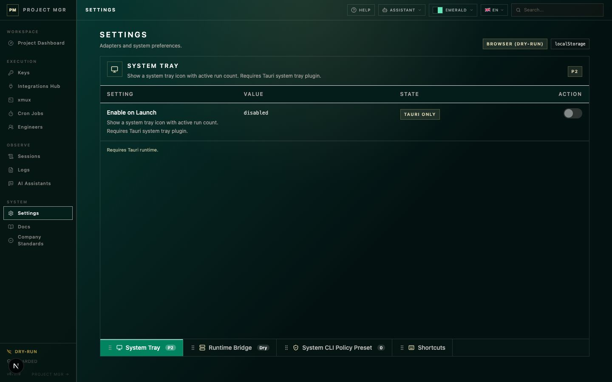
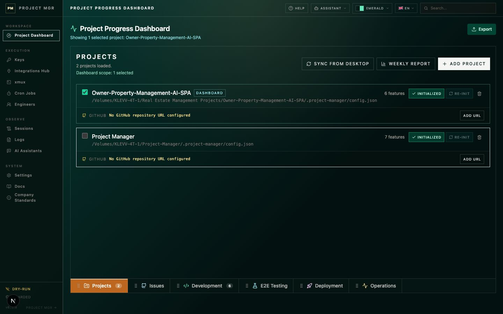

# Table and Sheet Layout — Project-Manager

Build data tables, sheets, and workstation-style views using **raw TanStack Table v8** and the project's reusable layout components. Reference implementations:

- `components/layout/WorkstationFrame.tsx` — viewport-fixed page frame with header / toolbar / content / bottom-tabs slots
- `components/sheets/BottomSheetTabs.tsx` — Excel-style sheet tabs (active indicator at top, icon + badge supported)
- `app/project-progress-dashboard/_components/SheetTabs.tsx` — Project Progress Dashboard's dedicated bottom sheets, including user-reorder persistence
- `components/table/TableCore.tsx` — table primitives, column patterns, styling tokens

## When to Use This Skill

- Creating a new view under `app/ui/views/` (table-heavy, sheet-with-tabs, dashboard, form — any of them)
- Adding or moving tab / sheet UI on an existing view
- Creating a new table in `components/table/` or extending `TableCore`
- Adding columns to an existing table
- Refactoring inline cell JSX into separate cell components
- Debugging sort, layout, scroll, sheet-tab-position, or double-scrollbar issues

## When NOT to Use

- Simple lists with < 5 rows (a plain `<ul>` is cleaner)
- Read-only single-column displays (use a card layout instead)
- Modal dialogs or popovers (different layout contract)

---

## Reusable Layout Components — Use These Before Inlining

Every page with a workstation contract (table, sheets, dashboard panels) **must** use `WorkstationFrame`. Every sheet tab strip **must** use `BottomSheetTabs`. Do not re-implement them inline — drift from the contract is the entire reason these components exist.

### WorkstationFrame

```tsx
import { WorkstationFrame } from '@/components/layout/WorkstationFrame';

<WorkstationFrame
  header={<h1>My View</h1>}
  toolbar={<FilterBar />}              // optional
  panelClassName="border border-stone-200/15 bg-[rgb(var(--pm-panel))]/72"
  scrollChildren={false}                // false when children own their own scroll (e.g. a table)
  bottomTabs={<BottomSheetTabs ... />}  // optional
>
  <YourContent />
</WorkstationFrame>
```

Slot rules:
- `header` — shrink-0. Title, breadcrumbs.
- `toolbar` — shrink-0. Filters, search, action buttons.
- `children` — flex-1, min-h-0. Owns the vertical scroll unless `scrollChildren={false}`.
- `bottomTabs` — shrink-0 at the very bottom. **Always pass `<BottomSheetTabs />` here. Never put a tab strip in the header.**
- `scrollChildren` — default `true`. Set to `false` when content has its own `overflow-auto` to avoid double scrollbars.

### BottomSheetTabs

```tsx
import { BottomSheetTabs, type SheetTabItem } from '@/components/sheets/BottomSheetTabs';

const TABS: ReadonlyArray<SheetTabItem<MyTabKey>> = [
  { key: 'overview', label: 'Overview', icon: <Layers size={14} />, badge: 12 },
  { key: 'details',  label: 'Details' },
];

<BottomSheetTabs tabs={TABS} activeKey={tab} onSelect={setTab} />
```

Tab strip sits at the **bottom** of the panel (Excel-style). Active indicator is the top white bar.

Reference migrations: `app/ui/views/ProjectFilesView.tsx`, `app/ui/views/KeysView.tsx`.

---

## Visual References

Images are reference aids for human review and AI orientation. They do not replace the written checklist below; every required behavior still needs code, tests, and browser verification.

### Settings table sheet reference



Use this as the reference shape for a settings-oriented table sheet:

- Header shows page title, short description, and current runtime/storage state.
- Sheet content is a structured setting table, not a decorative card grid.
- Each row has clear `Setting`, `Value`, `State`, and `Action` responsibilities.
- Actions are scoped to settings and local preferences; do not add fake `Add Row`, data export, KPI, or lifecycle controls.
- Bottom sheet tabs remain fixed at the bottom and represent settings groups.
- If settings rows become comparable data with multiple rows/columns, apply the table-backed requirements: resize, category filters where applicable, and contained horizontal scroll.

### Data-heavy dashboard table sheet reference



Use this as the reference shape for data-heavy and dashboard table sheets:

- Header shows page title, active project/data scope, and meaningful page-level actions.
- KPI/context strip summarizes operational state before the table.
- Toolbar controls are table-scoped: search, alignment/view controls, hidden columns, presets, reset, export, and row creation only when meaningful.
- Main pane is a dense spreadsheet-like grid with compact rows, semantic badges, editable cells, document columns, and explicit empty/filter states.
- Horizontal and vertical scrolling stay inside the workstation frame; bottom sheet tabs remain visible.
- Bottom sheets map to user workflow or lifecycle phases and show meaningful row/state badges.

---

## Required Table + Sheet Baseline

Before building or rewriting a table + sheet page, classify the page. Do not copy every Project Progress Dashboard control into every screen.

| Page type | Required intent |
|---|---|
| Settings table sheet | Structured setting rows, explicit state, clear actions, sheet navigation. Use table infrastructure when it has comparable rows/columns. |
| Data table sheet | Searchable, sortable, filterable, configurable dense rows. This is the default for operational datasets. |
| Dashboard table sheet | Data table sheet plus KPI/context summary and workflow-level actions. |
| Read-only sheet | Explicitly documented exception. Keep layout consistent, but skip edit/export controls that would be fake. |

### All table + sheet workstation pages

- Use `WorkstationFrame`; do not inline an equivalent frame.
- Use `BottomSheetTabs` for multi-sheet pages; tabs sit in the bottom slot.
- Keep header, toolbar, table/content pane, and bottom tabs in their correct slots.
- Keep bottom tabs visible and reachable on desktop and narrow viewports.
- Avoid page-level horizontal overflow. Tables may own their own horizontal scroll.
- Document any exception to full table infrastructure in feature notes or an ADR.

### Table-backed sheet pages

- Every manually assigned column id uses the `col-` prefix.
- Every visible table column exposes a clear header drag handle for user-resizable widths.
- Column width state persists by canonical `col-` id, not by display label or column index.
- Persisted widths normalize on read: drop unknown columns, clamp invalid widths, and apply defaults for newly-added columns.
- Multi-sheet pages enable `BottomSheetTabs` reorder support (`reorderable`) and provide a stable `orderStorageKey`.
- Persist only canonical sheet ids. Never persist translated labels, array indexes, or route-derived display text as order state.
- Add focused regression coverage for default sheet order, user reorder persistence, and invalid stored-order fallback.
- Empty, filtered-empty, loading, and error states are explicit.
- Interactive cells stop row-click propagation.

### Horizontally scrolling tables

- Provide a `Freeze cols` control that lets users pin at least the identity/action-critical columns needed to keep rows understandable while scrolling.
- Prefer the spreadsheet-style numeric `Freeze cols` control used by Integration Hub and dashboard sheets: freeze the first N visible columns, with `0` meaning no frozen columns. Use checkbox-style pinning only when non-contiguous pinning is a deliberate product requirement.
- Store frozen column ids by canonical `col-` id and normalize them against the current column set.
- Frozen columns use sticky positioning with computed left offsets, readable z-index layering, and an opaque/tokenized background.
- Frozen cells must not be clipped by the same element that owns horizontal scrolling; follow the overflow rules below.

### Category-like columns

- Every category-like field supports sorting and category filtering: examples include `category`, `status`, `phase`, `type`, `provider`, `source`, `scope`, `permission`, and `runtime`.
- Category filters use the raw semantic value as state and render labels/badges only in the display layer.
- Filtering controls belong in the table toolbar or header filter UI, near the data they affect.
- Sorting and filtering remain stable after column resize, freeze, sheet changes, and responsive layout changes.

### Toolbar semantics

Before adding or keeping a toolbar control, name the exact object it mutates:

- **View controls** mutate only table presentation: search text, filters, sorting, visible columns, column widths, frozen columns, row density, and view presets. These belong in the table toolbar or column header filter UI.
- **Dataset controls** mutate the rows owned by this table: add row, restore built-in rows, show hidden rows, reorder rows, or delete a custom row. These belong in the table toolbar only when the table owns that row data and the label says exactly what changes.
- **Credential, bridge, filesystem, network, or destructive controls** do not belong in a generic table toolbar. Put them in the row detail sheet, a settings/danger-zone panel, or a modal that shows scope and consequence.
- **Row health refresh controls** that re-check a row's status belong beside the status badge when they affect one row. Use per-row loading state; do not disable every row from one row refresh.

Do not add Import/Export just because another table has them. `Export` is valid only when the exported file is a user-meaningful artifact for the same dataset and can be described without ambiguity. `Import` is valid only when the imported file is a documented, previewable schema for the same dataset; never use a generic `Import` label when the user could confuse provider definitions, API keys, project files, or model lists.

Use specific verbs for provider/registry tables:

- `Restore default providers` means restore provider row membership/order/visibility only. It must preserve API keys, validation metadata, model cache, and other credential state.
- `Add provider` is clearer than `Add Row` when the row represents a provider entity.
- `Clear key` / `Clear all keys` must stay outside the table toolbar unless the whole page is a dedicated danger-zone workflow with explicit confirmation and per-item failure reporting.

### Data-heavy table sheets

- Include table-scoped search. Do not rely only on the global topbar search.
- Support column visibility controls such as `Hidden (n)` for non-essential columns.
- Support view presets for useful combinations of widths, hidden columns, frozen columns, sort, and filters.
- Provide a table-view `Reset` action that restores layout preferences without mutating domain data.
- Collapse repeated reference URLs such as API key pages, usage pages, and docs into small icon-only links inside the primary identity cell when they are secondary actions; do not spend separate table columns on low-frequency external links.
- Collapse simple row summary counts such as provider model counts into compact numeric badges inside the primary identity cell when the number is supporting context rather than a sortable analysis column.
- Collapse duplicated row status hints into icon indicators under the primary identity cell when the same meaning is already conveyed by nearby identity/action affordances.
- Consider row density, alignment, and visible row/column count controls when the table behaves like a spreadsheet.
- Add `Export` only when the page owns exportable data. Add `Add Row` only when the page owns editable rows.

### Dashboard table sheets

- Show a compact KPI/context strip when the page summarizes operational state.
- Show the active project/data scope near the title.
- Make sheet taxonomy follow the user's workflow or lifecycle, not implementation names.
- Use sheet badges for meaningful row counts or state counts.
- Agent, cron, run, or execution panels are required only when the page monitors execution.

These are not polish items. Treat them as table infrastructure for new table + sheet pages and for major rewrites of existing table + sheet pages, with the page classification deciding which tier applies.

### Reorderable bottom sheets

Table + sheet pages with more than one sheet must support user sheet reordering. Keep two concepts separate:

- **Canonical ids** — stable tab keys used by routes, URL hashes, types, tests, and feature logic.
- **Display order** — a per-user UI preference that may be persisted locally.

Rules:

1. Never encode user display order into domain data or feature schema.
2. Persist only a list of canonical ids, then normalize it on read: remove unknown ids, remove duplicates, append any newly-added sheets in default order.
3. Keep URL hash validation and type unions based on canonical ids, not the stored display order.
4. In Next.js/SSR routes, do not read `localStorage` in the `useState` initializer for the first render. Start with the default order so server and client HTML match, then read persisted order in `useEffect` after mount.
5. Add focused tests for default order, reorder persistence, and invalid stored-order fallback.
6. For drag reordering, do not rely on native HTML5 `draggable` on `<button>` tabs; it can look wired but fail in real pointer use. Prefer pointer/mouse handling where pressing a tab and entering another tab immediately reorders the display list. Store the currently dragged id in a ref as well as state, because `pointerenter` can fire before React has committed the `pointerdown` state update.
7. Drag microinteractions should be restrained: slight lift, scale, tilt, shadow, and target ring are enough. If the user expects the sheet to follow the pointer, render a separate fixed-position drag ghost that tracks pointer coordinates while the original tab stays in the strip as a dimmed placeholder. Use short transform transitions and include `motion-reduce` fallbacks so reduced-motion users do not get animated movement.
8. Prefer a shared tab component. If a view needs a dedicated tab strip for special styling/i18n, document the exception and keep its contract equivalent to `BottomSheetTabs`.

Project Progress Dashboard lesson: its tab contract has historically touched multiple files. Before changing dashboard sheet behavior, check:

- `app/project-progress-dashboard/types.ts` — canonical `SHEET_IDS` / `TabId`
- `app/project-progress-dashboard/ProjectProgressClient.tsx` — URL hash validation and active-tab state
- `app/project-progress-dashboard/_components/SheetTabs.tsx` — visible tab metadata, order, and reorder persistence
- `__tests__/progressDashboard.SheetTabs.test.tsx` — ordering and selection regression coverage

---

## Source Files — Read Before Generating

1. `components/layout/WorkstationFrame.tsx` — frame contract
2. `components/sheets/BottomSheetTabs.tsx` — bottom-tab contract
3. `components/table/TableCore.tsx` — table component (column patterns, styling tokens)
4. `lib/types/index.ts` — `Feature`, `FeatureStatus`, `FeaturePaths` type definitions
5. For Project Progress Dashboard sheets: `app/project-progress-dashboard/types.ts`, `app/project-progress-dashboard/ProjectProgressClient.tsx`, `app/project-progress-dashboard/_components/SheetTabs.tsx`

---

## Column Conventions

### Column ID prefix

Use `col-` prefix on all manually-assigned `id` fields to avoid conflicts with TanStack internals:

```tsx
{ id: 'col-spec', accessorFn: (row) => row.paths?.spec, ... }  // Good
{ id: 'spec', ... }  // Risky — may conflict
```

### Accessor pattern for nested / optional paths

```tsx
columnHelper.accessor((row) => row.paths?.spec, {
  id: 'col-spec',
  header: 'Spec',
  cell: (info) => renderPathCell(info.getValue()),
})
```

### Column sizing and frozen-column state

Column ids are the persistence boundary for resize and freeze preferences:

```tsx
const [columnSizing, setColumnSizing] = useState<Record<string, number>>({});
const [frozenColumnIds, setFrozenColumnIds] = useState<string[]>(['col-project', 'col-name']);

const table = useReactTable({
  data,
  columns,
  state: { columnSizing },
  onColumnSizingChange: setColumnSizing,
  columnResizeMode: 'onChange',
  getCoreRowModel: getCoreRowModel(),
});
```

Rules:

- All persisted width/freeze preferences must reference `col-` ids.
- Clamp restored widths to the column's supported min/max range before applying them.
- Do not persist widths for display-only transient columns unless users can see and resize them.
- Frozen columns should be user-controlled, but start with sensible defaults for row identity columns.
- If a frozen column is hidden or removed, remove it from the frozen list instead of leaving stale state.

### Numeric columns — the most important rule

> **Cells store `number | null`. Units live in the header. Never embed `%`, `k`, `M`, or any unit in the cell value.**

With numbers in cells, TanStack's default sort works correctly. With strings it uses lexicographic order, which is always wrong for numeric data:

| Strings (broken sort asc) | Numbers (correct sort asc) |
|---|---|
| `"8.2", "45", "120.3"` → `120.3, 45, 8.2` ❌ | `8.2, 45, 120.3` ✅ |
| `"10%", "4%", "100%"` → `10%, 100%, 4%` ❌ | `4, 10, 100` ✅ |

**Pattern:**

```tsx
// Row type — number, not string
progress: number;   // NOT: progress: string | "45%"

// Header carries the unit
header: 'Progress (%)',

// Cell formats the raw number
cell: (info) => {
  const v = info.getValue() ?? 0;
  return (
    <div className="flex items-center gap-2">
      <div className="h-2 w-24 bg-stone-200/15">
        <div className="h-2 bg-emerald-400" style={{ width: `${Math.min(100, v)}%` }} />
      </div>
      <span className="w-9 text-right font-mono text-xs text-stone-400">{v}%</span>
    </div>
  );
},
```

### Category columns — sorting and filters are mandatory

For every category-like column, use stable raw values for sorting/filtering and render friendly labels in the cell:

```tsx
columnHelper.accessor('category', {
  id: 'col-category',
  header: 'Category',
  enableSorting: true,
  enableColumnFilter: true,
  filterFn: 'equalsString',
  cell: (info) => (
    <span className="border border-amber-200/20 bg-amber-100/10 px-2 py-1 text-xs text-amber-100/90">
      {info.getValue()}
    </span>
  ),
})
```

Toolbar/header filter controls should:

- derive option lists from current table data,
- keep filter state as raw category ids/values,
- show a clear empty state when filters remove all rows,
- preserve active filters when users switch sheet tabs if the sheet still uses the same table.

---

## Colour System (dark theme tokens)

Project-Manager uses a dark stone/emerald palette. Use these instead of hardcoded colours:

| Purpose | Token |
|---|---|
| Primary text | `text-stone-100` |
| Secondary text | `text-stone-300` |
| Muted/dim text | `text-stone-400` / `text-stone-500` |
| Monospace paths | `font-mono text-xs text-stone-300` |
| Empty / null value | `text-xs text-stone-500` |
| Category badge | `border border-amber-200/20 bg-amber-100/10 text-amber-100/90` |
| Status: done | `bg-emerald-500/15 text-emerald-400` |
| Status: in_progress | `bg-sky-500/15 text-sky-400` |
| Status: todo | `bg-stone-500/15 text-stone-400` |
| Status: on_hold | `bg-red-500/15 text-red-400` |
| Action button | `border border-emerald-200/25 bg-emerald-100/10 text-emerald-100 hover:bg-emerald-100/18` |
| Table header bg | `bg-white/[0.035]` |
| Row hover | `hover:bg-white/[0.045]` |
| Row divider | `border-b border-stone-200/10` |

---

## Common Cell Patterns

### Dashboard path cells

Project Progress Dashboard path columns must not display raw file paths. Render fixed labels and keep the full absolute path in `title` only. Markdown artifacts should open the dashboard document panel, not the OS default Markdown app.

```tsx
function renderDashboardPathCell(
  projectRoot: string,
  relPath: string | undefined,
  label: string,
  onOpenPanel?: (absPath: string) => void,
) {
  return (
    <PathLink
      projectRoot={projectRoot}
      relPath={relPath}
      label={label}
      onOpenPanel={onOpenPanel}
    />
  );
}
```

Use these canonical labels for Project Progress Dashboard document columns:

| Column | Label |
|---|---|
| README | `README.md` |
| Feature Spec | `feature-spec.md` |
| TDD Spec | `tdd-spec.md` |
| TDD Report | `tdd-report.md` |
| Dev Logs | `dev-log.md` |

### Null / empty value cell

```tsx
function renderEmptyCell() {
  return <span className="text-xs text-stone-500">—</span>;
}
```

### Status badge

```tsx
const STATUS_COLORS: Record<FeatureStatus, string> = {
  done:        'bg-emerald-500/15 text-emerald-400',
  in_progress: 'bg-sky-500/15 text-sky-400',
  todo:        'bg-stone-500/15 text-stone-400',
  on_hold:     'bg-red-500/15 text-red-400',
};

cell: (info) => (
  <span className={`px-2 py-0.5 text-[10px] font-semibold ${STATUS_COLORS[info.getValue()]}`}>
    {STATUS_LABELS[info.getValue()]}
  </span>
)
```

### Action button in cell (stop propagation)

Row-click handlers are wired on `<tr>`. Any interactive child **must** call `e.stopPropagation()`:

```tsx
cell: (info) => (
  <button
    onClick={(e) => {
      e.stopPropagation();   // prevent triggering onRowClick
      onAction(info.row.original);
    }}
    className="inline-flex h-7 items-center gap-1.5 border border-emerald-200/25 bg-emerald-100/10 px-2.5 text-xs font-medium text-emerald-100 hover:bg-emerald-100/18"
  >
    ...
  </button>
)
```

---

## Complex Cells — When to Extract

Extract a cell to its own `*Cell.tsx` file when it:

- Exceeds ~30 lines of JSX
- Has its own `useState`, `useMemo`, or `useEffect`
- Has multiple conditional render states (e.g. based on row status)

**Pattern:**

```tsx
// components/table/FeatureActionsCell.tsx
type Props = { row: Feature; onDispatch: (f: Feature) => void };
export function FeatureActionsCell({ row, onDispatch }: Props) { ... }

// In TableCore.tsx — createColumns factory
function createColumns(deps: { onDispatch: (f: Feature) => void }) {
  return [
    ...
    columnHelper.display({
      id: 'col-actions',
      cell: ({ row }) => <FeatureActionsCell row={row.original} onDispatch={deps.onDispatch} />,
    }),
  ];
}
```

---

## Table Layout Rules

### Horizontal scroll

Wrap the table in `overflow-x-auto` only. Never add `overflow-hidden` on the same container — it will clip sticky headers and scroll bars.

```tsx
<div className="overflow-x-auto bg-transparent">
  <table className="w-full border-collapse text-left">
    ...
  </table>
</div>
```

### Sticky header

Apply `sticky top-0 z-10` to the `<thead>` (or its wrapper), **not** to individual `<th>` elements:

```tsx
<thead className="sticky top-0 z-10 border-b border-stone-200/12 bg-stone-900">
```

### Resizable headers

Resizable table headers must include:

- a visible resize handle at the right edge of each resizable header cell,
- pointer/touch hit area large enough to drag reliably,
- cursor feedback (`col-resize`) and keyboard/focus-visible affordance where practical,
- min/max width constraints so text and controls do not collapse,
- persisted widths restored after reload.

Do not put resize handles inside cells where row click handlers can capture them. Header interactions should not trigger row actions.

### Freeze columns / pinned columns

Frozen columns need sticky positioning and computed offsets:

```tsx
<th
  className="sticky left-0 z-20 bg-[rgb(var(--pm-panel))]"
  style={{ width: header.getSize(), left: frozenLeftOffset }}
>
  ...
</th>
```

Rules:

- Freeze controls belong in the table toolbar or a column menu labelled `Freeze cols`.
- The frozen-column list is a user preference, separate from the canonical column definitions.
- Frozen headers and body cells must use compatible `left` offsets and z-index layers.
- Add an inset border or shadow at the trailing edge of the last frozen column so the boundary remains visible while scrolling.
- Never combine the horizontal scroll owner and clipping styles in a way that hides sticky frozen cells.

### Avoid double scrollbars

If the parent layout (`AppShell`, `MainClient`, a view component) already has `overflow-y-auto`, do **not** add another `overflow-y-auto` inside the table container. One scroll region should own the vertical flow.

### Workstation viewport contract (critical)

For dashboard-like pages where toolbar + table + bottom sheets must stay in one visible frame, use a fixed-height workspace and a single inner scroll pane:

```tsx
<div className="flex h-[calc(100vh-8rem)] min-h-0 flex-col overflow-hidden">
  <div className="shrink-0">{/* header */}</div>
  <div className="flex min-h-0 flex-1 flex-col overflow-hidden">
    <div className="shrink-0">{/* toolbar */}</div>
    <div className="min-h-0 flex-1 overflow-auto">
      {/* table container (may include overflow-x-auto internally) */}
    </div>
    <div className="shrink-0">{/* bottom sheet tabs */}</div>
  </div>
</div>
```

**Common pitfall:** using `min-h-[calc(100vh-8rem)]` instead of `h-[calc(100vh-8rem)]` allows content growth, which pushes bottom sheet tabs below the viewport.

### Overflow-hidden usage rule (clarified)

- Allowed on **layout wrappers** to keep the workstation in one frame.
- Not allowed on the **same element** that owns table scrolling (`overflow-x-auto` / `overflow-auto`).

### Table in flex layout (fill remaining height)

```tsx
<div className="flex flex-col flex-1 min-h-0">
  <div className="shrink-0"><!-- toolbar / filters --></div>
  <div className="flex-1 min-h-0 overflow-y-auto">
    <TableCore ... />
  </div>
</div>
```

### z-index leakage from positioned cell content

If a cell contains an absolutely-positioned overlay (badge, tooltip, dropdown), add `relative isolate` to the cell wrapper so `z-index` doesn't bleed into adjacent columns:

```tsx
<td className="relative isolate px-4 py-3 text-sm text-stone-300">
  {flexRender(cell.column.columnDef.cell, cell.getContext())}
</td>
```

---

## Empty State

Always handle zero rows explicitly:

```tsx
{table.getRowModel().rows.length === 0 && (
  <tr>
    <td
      colSpan={table.getVisibleLeafColumns().length}
      className="px-4 py-8 text-center text-xs text-stone-500"
    >
      No features match the current filter.
    </td>
  </tr>
)}
```

---

## Engineer Initialization Checklist For Table + Sheet Pages

Run this checklist before implementation. It decides which parts of the baseline apply and prevents cargo-culting dashboard-only controls into simple settings pages.

### 1. Page classification

- [ ] Identify page type: settings table sheet, data table sheet, dashboard table sheet, or read-only sheet.
- [ ] Identify whether the page owns editable rows, exportable data, or only local preferences.
- [ ] Document any exception to full table infrastructure before building the UI.
- [ ] If the page is read-only or settings-only, do not add fake `Add Row`, `Export`, KPI, or lifecycle controls.

### 2. Workstation structure

- [ ] Use `WorkstationFrame`.
- [ ] Put title/context in `header`.
- [ ] Put filters/search/view controls in `toolbar`.
- [ ] Put the table or sheet content in the content pane.
- [ ] Put `BottomSheetTabs` only in `bottomTabs`.
- [ ] Keep bottom tabs visible in desktop and narrow viewport checks.
- [ ] Avoid page-level horizontal overflow; table overflow must be contained.

### 3. Sheet governance

- [ ] Sheet ids are canonical, typed, and independent from display labels.
- [ ] Multi-sheet pages enable drag reorder with `BottomSheetTabs reorderable`.
- [ ] Sheet order persists by canonical ids through a stable `orderStorageKey`.
- [ ] Stored sheet order is normalized: remove unknown ids, remove duplicates, append newly-added sheets.
- [ ] URL hash validation and type unions use canonical ids, not persisted order.
- [ ] Focused tests cover default order, reorder persistence, and invalid stored-order fallback.

### 4. Column governance

- [ ] All manually assigned column ids use `col-` prefix.
- [ ] Column resize is implemented through TanStack Table column sizing state.
- [ ] Column widths persist by canonical `col-` id and normalize stale/invalid stored values.
- [ ] Horizontally scrolling tables expose a `Freeze cols` control.
- [ ] Frozen columns persist by canonical `col-` id and normalize stale ids.
- [ ] Frozen headers/body cells use sticky left offsets, tokenized backgrounds, and readable z-index.
- [ ] Data-heavy tables support hidden-column controls.
- [ ] Data-heavy tables support view presets and a view-only reset action.

### 5. Sorting and filtering

- [ ] Category-like columns support sorting.
- [ ] Category-like columns support filtering.
- [ ] Filter state uses raw semantic values.
- [ ] Filter controls live in the table toolbar or header filter UI.
- [ ] Filtered-empty state is explicit and distinct from true zero-data empty state.
- [ ] Sorting/filtering survive sheet switching, resize, freeze, and responsive checks.

### 6. Toolbar and page actions

- [ ] Data-heavy tables include table-scoped search.
- [ ] Dashboard table sheets show compact KPI/context summary when they summarize operational state.
- [ ] Active project/data scope is visible for project-scoped tables.
- [ ] `Export` exists only when data export is meaningful.
- [ ] `Import` exists only when the page owns a documented, previewable import schema for the same dataset.
- [ ] `Add Row` exists only when the page owns editable rows; prefer domain labels such as `Add provider` when clearer.
- [ ] `Reset` clearly resets view preferences, not domain data, unless explicitly labelled otherwise.
- [ ] Restore/default actions name the domain object they restore and preserve unrelated secrets/cache/metadata.
- [ ] Credential, filesystem, network, and destructive actions are not placed in a generic table toolbar.
- [ ] Row health refresh actions sit near the status indicator and use per-row loading state.

### 7. Cell interaction

- [ ] Interactive cells call `e.stopPropagation()` when rows have click behavior.
- [ ] Buttons, links, selects, checkboxes, menus, and resize handles have visible focus states.
- [ ] Secondary external links are icon-only with accessible labels/tooltips when embedded under the row identity.
- [ ] Supporting row counts are compact numeric badges under the row identity when they are not needed as standalone sortable columns.
- [ ] Repeated status hints are not duplicated as standalone columns and identity-adjacent icons.
- [ ] Risky/destructive actions are explicit and show scope/consequence.
- [ ] Document/path cells show stable labels, with raw paths in tooltip/context metadata only.

### 8. Responsive and verification

- [ ] Desktop viewport check confirms toolbar, table, and bottom tabs fit in one workstation frame.
- [ ] Narrow viewport check confirms table horizontal scroll is contained.
- [ ] Frozen columns remain readable while horizontally scrolling.
- [ ] Text does not overlap, wrap awkwardly, or overflow controls.
- [ ] Focused tests cover sheet order, column preferences, filters, and empty states for the touched page.
- [ ] Run `npm run typecheck`; run targeted tests and broader checks when shared components changed.

---

## Checklist Before Shipping

- [ ] All `id` fields use `col-` prefix
- [ ] Users can drag column headers to resize visible columns
- [ ] Column widths persist by canonical `col-` id and normalize stale/invalid stored values
- [ ] Multi-sheet pages enable bottom sheet drag reordering with a stable `orderStorageKey`
- [ ] Reorderable sheets persist display order as canonical ids and normalize missing/unknown/duplicate ids on read
- [ ] Tables with horizontal scroll expose a `Freeze cols` control
- [ ] Frozen columns persist by canonical `col-` id, use sticky left offsets, and remain readable during horizontal scroll
- [ ] Category-like columns support both sorting and category filtering
- [ ] Data-heavy tables include table-scoped search
- [ ] Data-heavy tables support hidden columns, view presets, and view reset when applicable
- [ ] Dashboard tables show active project/data scope and KPI/context summary when applicable
- [ ] `Add Row`, `Import`, and `Export` are present only when the page owns editable/importable/exportable data with clear user value
- [ ] Generic table toolbars do not contain credential clearing, filesystem, bridge, network, or other destructive controls
- [ ] Numeric columns store `number | null`, units in header
- [ ] Action buttons call `e.stopPropagation()`
- [ ] Cells > 30 lines extracted to `*Cell.tsx`
- [ ] Table scroll container does not mix with `overflow-hidden`
- [ ] Dashboard-like views use fixed-height workstation contract (`h-[calc(100vh-8rem)]` + `shrink-0` header/toolbar/sheets)
- [ ] Empty state row present
- [ ] Colours use stone/emerald token palette (no hardcoded `gray-*`)
