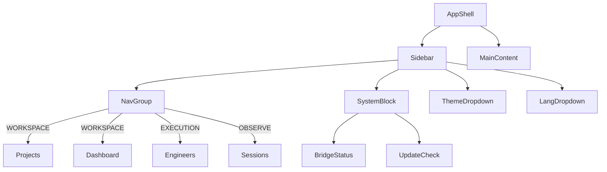

# F01 — Sidebar Navigation

**Status**: done | **Progress**: 100%  
**Category**: Frontend/UI  
**Implementation**: `app/ui/Sidebar.tsx`

## Summary

180px fixed sidebar with text labels and icons, organized into 4 nav groups:
- **WORKSPACE** — Projects, Dashboard, Coding Editor
- **EXECUTION** — Engineers, Plugins, Channels, Cron Jobs
- **OBSERVE** — Sessions, Logs
- **SYSTEM** — Keys, Shortcuts, Settings, Docs

## Bottom System Block

- Bridge connection status (Wifi / WifiOff icon)
- Active run count with pulse animation
- GUARDED security indicator
- Check for Updates button (Tauri desktop only)

## Theme / Language Dropdowns

Hermes-style upward dropdowns at the bottom of the sidebar:
- **Theme**: Emerald / Midnight / Ember / Mono (mini dual-color swatch preview)
- **Language**: EN / 繁中 / 简中 / JA (flag + full native name)

Persistence: `localStorage` keys `pm-theme` and `pm-lang`.  
Theme applies via `data-theme` attribute on `document.documentElement`.

## Component Architecture

## Related Files

- `lib/hooks/useTheme.ts` — theme state + CSS var application
- `lib/hooks/useLang.ts` — language preference hook
- `app/globals.css` — `--pm-sidebar`, `--pm-active-bg`, `--pm-bg`, `pm-bg-noise`, `pm-bg-glow`
- `app/ui/AppShell.tsx` — grid host for sidebar
