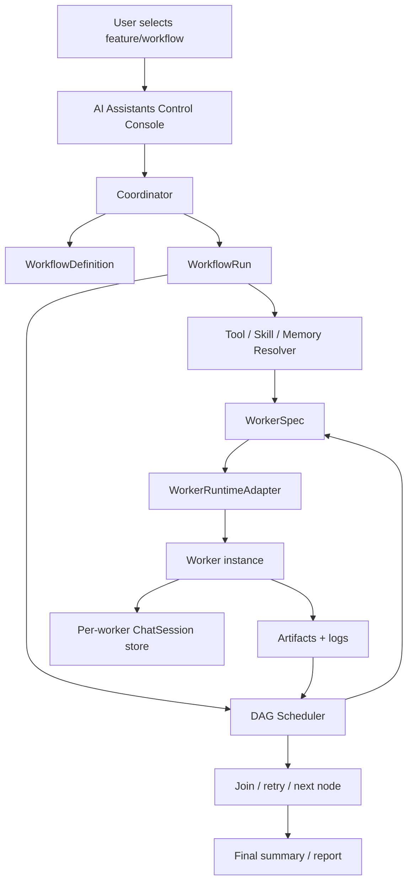
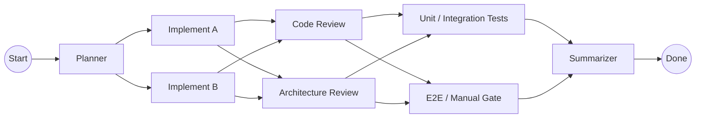
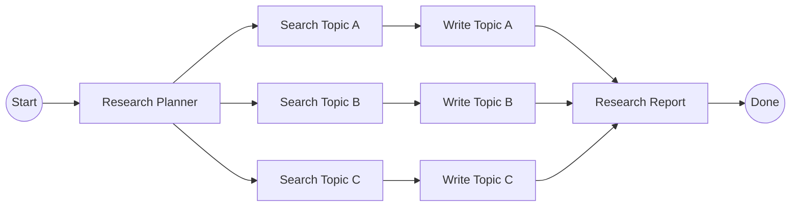
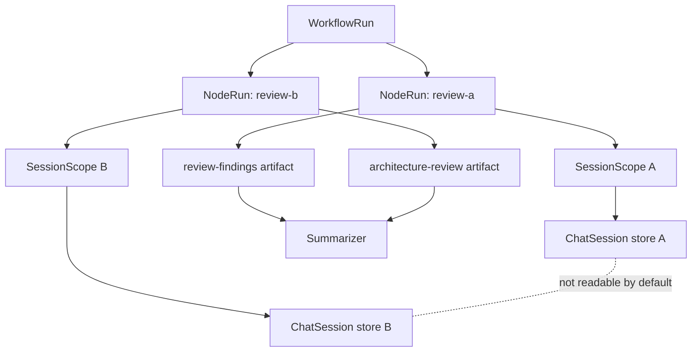

# F35: Agent Workflow DAG Control Plane

## Purpose

Give Project Manager a first-class control plane for multi-agent workflows. F35 is not only a TypeScript DAG model; it is the shared product and engineering vocabulary for how Project Manager creates AI Engineers, schedules Workers, isolates memory, monitors runs, and eventually connects execution runtimes such as xmux, CubeSandbox, E2B, Hermes, and OpenClaw.

## Product Positioning

Project Manager has four related but distinct surfaces:

| Surface | Responsibility |
| --- | --- |
| AI Assistants Control Console | Operator-facing mission control for assistant instances, chat, engineer roles, permissions, jobs, logs, and audits. |
| AI Engineers | Role catalog: job descriptions, model preferences, skills, working scope, capabilities, and test prompts. |
| Dispatch / Development sheet | Task entry point: choose a feature, workflow template, engineer roles, runtime, and approval mode. |
| Sessions / Logs | Evidence surfaces: transcripts, per-worker session records, run logs, artifacts, failures, retry history. |

F35 defines the control-plane contract that ties those surfaces together.

## Glossary

| Term | Definition | Example / Notes |
| --- | --- | --- |
| Coordinator | Project Manager module that reads a WorkflowDefinition, creates a WorkflowRun, schedules nodes, handles retries, and records artifacts. It is the "master server" in the architecture sketch. | Decides when `review-a` can run after implementation nodes finish. |
| AI Assistant | User-facing assistant instance in the AI Assistants Control Console. It can chat, hold profile settings, show permissions, and dispatch or supervise workflows. | PM Assistant, Dreaming Assistant. |
| AI Engineer | Reusable role definition. It describes expertise, model preference, prompt, skills, working scope, and capabilities. | Frontend Engineer, Reviewer, QA Lead, Research Writer. |
| Worker | Runtime instance created for one WorkflowNodeRun. It executes a specific node with a specific AI Engineer, model, tools, memory scope, and runtime provider. | A CubeSandbox microVM running `search-topic-a`. |
| Workflow | Named business process template made of nodes and dependencies. | Software Development, Deep Research, Ship Readiness. |
| DAG | Directed acyclic graph. Nodes have one-way dependencies and must not form cycles. | Planner -> Implementer -> Reviewer -> Summarizer. |
| Node | Step in a workflow template. A node declares role, dependencies, runtime, tool bundle, retry policy, and output contract. | `planner`, `implement-a`, `report`. |
| Edge | Directed dependency between nodes. | `planner -> implement-a`. |
| WorkflowDefinition | Static template for a workflow. It can be built-in or later user-authored. | `software-dev-parallel`. |
| WorkflowRun | One live or historical execution of a WorkflowDefinition. | `run-2026-05-28-001`. |
| WorkflowNodeRun | One node execution inside a WorkflowRun. | `run-001 / review-a`. |
| Runtime Adapter | Provider-specific implementation that can create, resume, execute, stream, pause, and destroy Workers. | `xmux`, `cube-sandbox`, `e2b`. |
| Agent Harness | Process wrapper/protocol that knows how to talk to the selected agent runtime. | Claude Code CLI, Codex CLI, OpenAI Agents SDK, custom shell harness. |
| Tool Bundle | Declared list of tools, skills, MCP servers, memory files, commands, plugins, and capability candidates a Worker may use. | `context7`, `exa-search`, `project-instructions`, `vitest-focused`. |
| Memory | Durable context allowed to influence future runs. Must be scoped and reviewable; hidden global memory is not allowed for DAG Workers. | Project instruction memory, role memory, workflow-run memory. |
| ChatSession Store | Transcript/session persistence for one assistant or worker. For Workers, it must be namespaced by project + workflow + run + node + agent. | `pm-agent-session__project-X__workflow-Y__run-Z__node-review-a__agent-reviewer-1`. |
| Artifact | Declared output produced by a node and consumed by later nodes. | `implementation-plan`, `review-findings`, `research-report`. |
| Checkpoint | Restorable execution state for a Worker. Can be transcript-only, filesystem snapshot, runtime pause token, or sandbox session state. | CubeSandbox `pause_on_exit`, xmux session marker. |
| Resume Point | The checkpoint selected when recreating or resuming a Worker. | Resume `review-a` from its own checkpoint, not `review-b`. |
| Join | A node waiting for multiple upstream nodes. | `summarizer` waits for `unit-test` and `e2e-test`. |
| Retry Policy | Per-node rule for retryable failures. | Retry runtime error once, block on missing tool. |
| Output Contract | Required artifacts a node must produce before downstream nodes can run. | Reviewer must output severity-ordered findings. |

## Control-Plane Flow

## Software Development Workflow

| Node | Role | Inputs | Required outputs |
| --- | --- | --- | --- |
| Planner | Planner AI Engineer | Feature spec, codebase context, user request | Implementation plan, branch split, verification matrix |
| Implement A / B | Implementer Workers | Planner artifact, scoped files, allowed tools | Code diff, focused verification evidence |
| Code Review | Reviewer Worker | Implementation artifacts, diff, tests | Severity-ordered findings |
| Architecture Review | Reviewer Worker | Implementation artifacts, ADRs, boundaries | Architecture risks, ADR conflicts, open decisions |
| Unit / Integration Tests | Tester Worker | Review outputs, changed files | Test command, result, failures |
| E2E / Manual Gate | Evaluator Worker | Review outputs, UX paths | Manual/E2E readiness result |
| Summarizer | Summarizer Worker | Declared artifacts only | Handoff summary, remaining risks |

## Deep Research Workflow

| Node | Role | Inputs | Required outputs |
| --- | --- | --- | --- |
| Research Planner | Planner AI Engineer | Research prompt, quality criteria | Research brief, source criteria, branch topics |
| Search Topic A/B/C | Researcher Workers | Research brief, search tools | Curated source notes and uncertainty notes |
| Write Topic A/B/C | Writer Workers | Source notes for one topic | Draft report section |
| Research Report | Summarizer Worker | Draft sections and source notes | Final report, source summary, confidence / uncertainty |

## Memory and Session Isolation

Rules:

- Each Worker has its own ChatSession store.
- Store key includes `projectId`, `workflowId`, `workflowRunId`, `nodeId`, and `agentId`.
- Downstream nodes read declared artifacts by default, not hidden sibling transcripts.
- Cross-node transcript reads require an explicit policy flag and UI warning.
- Global assistant chat history must never be reused as worker memory.

## Edit Engineer Role Vocabulary

| Field / Section | Meaning | Control-plane use |
| --- | --- | --- |
| Role Name | Human-readable role label. | Shown in dropdowns, tables, and run logs. |
| Slug | Stable short ID. | Used in chips, filters, and future WorkflowDefinition role matching. |
| Default Agent | Preferred adapter/harness for this role. | Seeds Worker runtime selection when workflow node does not override it. |
| Primary Provider | Default LLM provider. | Used by direct AI calls and runtime adapters that accept model routing. |
| Primary Model | Exact model ID. | Passed to the provider or CLI harness; must stay editable. |
| Fallback Chain | Ordered backup providers/models. | Used for direct LLM execution; CLI runtimes may ignore or partially support it. |
| Skills | Human-readable capabilities/work methods. | Matched to project skill packs and prompt sections. |
| System Prompt | Durable role instruction. | Prepended to node prompt after protocol and before task body. |
| Capabilities | Qualified Eyes / Voice / Hands / Recording / Tools candidates. | Resolved through Integrations Hub before Worker creation. |
| Test Prompt | Sanity-check prompt for this role. | Verifies provider/model behavior before dispatch. |
| Working Scope | Allowed file/path boundary. | Injected into prompt; strict mode surfaces dispatch warning. |
| Runtime Preference | Future field for local/xmux/CubeSandbox/E2B preference. | Helps Coordinator pick WorkerRuntimeAdapter. |
| Session Policy | Future field for new/resume/checkpoint behavior. | Prevents accidental memory reuse across Workers. |

## AI Assistants Control Console Usage Model

The Console should become the operator's control room for agent orchestration.

| Console area | User job | F35 requirement |
| --- | --- | --- |
| Chat | Ask, inspect, and issue high-level commands. | Chat can create workflow proposals but must not silently mutate role/memory state. |
| Overview | See selected assistant identity, runtime health, and current state. | Show active WorkflowRuns and blocked states. |
| AI Engineers | Create and edit role definitions. | Explain role fields in terms users can map to Worker behavior. |
| Profiles / Skills / Memory | Review context sources. | Show whether a source is global, project-scoped, role-scoped, or worker-scoped. |
| Dreaming / Jobs | Offline proposal generation. | Output proposals/artifacts, not direct config mutations. |
| Permissions | Risk gates for tools, file access, command execution, and memory writes. | A Worker cannot use a tool unless permissions and capability candidates pass. |
| Audit | Who changed what, when, and why. | Workflow creation, retry, resume, cancellation, and memory access must be auditable. |

## Functional Requirements

- Add typed workflow DAG definitions with stable IDs and version numbers.
- Nodes declare role, runtime profile, model selection mode, session policy, tool bundle, input dependencies, retry policy, and output contract.
- Edges are explicit and acyclic.
- Built-in templates include `software-dev-parallel` and `deep-research-parallel`.
- Session scope must include `projectId`, `workflowId`, `workflowRunId`, `nodeId`, and `agentId`.
- Session store keys must be deterministic, path-safe, and unique by worker node.
- Helper validation must reject missing node IDs, dangling edges, duplicate node IDs, and cycles.
- Feature docs must define product vocabulary before UI wiring expands.
- The initial implementation must not store API keys, SSH keys, raw secrets, or global memory in workflow definitions.

## Data Contract Groups

| Contract | Purpose | Current / future |
| --- | --- | --- |
| `WorkflowDefinition` | Static DAG template. | Current F35 type. |
| `WorkflowRun` | One execution of a workflow. | Next implementation slice. |
| `WorkflowNodeRun` | One node's runtime state. | Next implementation slice. |
| `WorkerSpec` | Worker creation payload. | Next implementation slice. |
| `WorkerRuntimeProfile` | Runtime provider and isolation shape. | Current F35 type. |
| `WorkerRuntimeAdapter` | Runtime provider interface. | Next implementation slice. |
| `AgentSessionScope` | Per-worker session namespace. | Current F35 type/helper. |
| `ToolBundleRef` | Integrations Hub candidate references. | Current F35 type. |
| `ArtifactContract` | Required node output. | Current F35 type. |

## Technical Requirements

- Source modules live under `lib/agent-workflows/`.
- Existing flat prompt workflow helpers remain backward compatible.
- New tests live in `__tests__/agentWorkflowDag.test.ts`.
- Architecture rationale is captured in `docs/architecture/ADR-013-agent-workflow-dag-control-plane.md`.
- User-facing guides explain AI Assistants Control Console and Agent Workflows before UI expansion.
- Feature config points Development sheet to README, feature spec, TDD spec, user scenarios, dev log, implementation, and test paths.

## Acceptance Criteria

1. F35 appears in Project Dashboard > Development sheet with README, feature spec, TDD spec, user scenarios, and dev log paths.
2. `listAgentWorkflowDags()` returns the two default DAG templates.
3. DAG validation passes for built-in templates.
4. A deliberately cyclic workflow returns a validation error.
5. Session store keys differ across workflow run/node/agent combinations.
6. F35 feature docs define Coordinator, AI Assistant, AI Engineer, Worker, Workflow, DAG, Memory, Session, Artifact, Runtime Adapter, Harness, Checkpoint, and Resume Point.
7. F35 feature docs include flow diagrams for control plane, Software Development, Deep Research, and memory/session isolation.
8. User guides explain how the AI Assistants Control Console relates to AI Engineers, Dispatch, Integrations Hub, Sessions, and Logs.
9. Existing `DEFAULT_AGENT_WORKFLOWS` tests continue to pass.
10. `npm run docs:check`, `npm run docs:site:check`, and focused tests complete or failures are documented.

## Open Decisions

- Whether user-authored workflow definitions should later live in `.project-manager/config.json`, `.project-manager/workflows/*.json`, or a hybrid of built-in TypeScript templates plus JSON overrides.
- Whether the long-running scheduler belongs in Tauri/Rust or remains in renderer until workflow execution is stable.
- How much raw prior-node transcript a downstream summarizer may request versus only reading declared artifacts.
- Whether AI Assistants Control Console should get a dedicated Workflow Runs sheet before Dispatch UI is upgraded.
- How to expose CubeSandbox templates and pause/resume state without leaking runtime-specific fields into user-authored workflow definitions.
