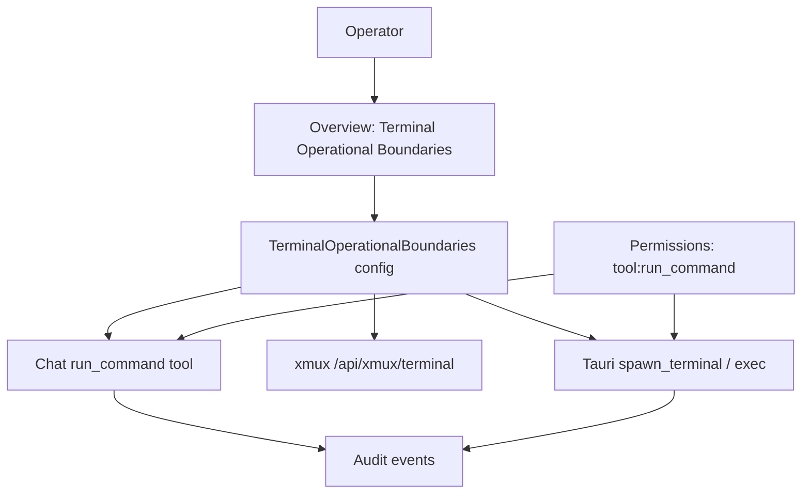

# F41: Terminal Operational Boundaries

## Purpose

Give operators a visible, auditable **terminal command safety policy** for AI assistants. Today, `run_command` uses a small hard-coded regex blacklist and xmux dev terminal uses an exact-match allowlist — neither is surfaced in the Console, neither is shared, and neither covers the full assistant execution surface. F41 unifies these into one default-deny whitelist/blacklist model with enforcement at execution time.

## Background

### Local evidence

| Surface | Current behavior | Gap |
| --- | --- | --- |
| Overview sheet | Showed first 5 permission scopes (`profile:read`, `tool:run_command`, …) | Not terminal-specific; mixed with non-shell permissions |
| `lib/chat/toolExecutor.ts` | Ad-hoc `BLOCKED_COMMANDS` regex array; otherwise allows any command under project root | No whitelist; no Console visibility; dev-server only path |
| `app/api/xmux/terminal/route.ts` | Exact-match allowlist (`pwd`, `git status --short`, …) + `execFile` | Disconnected from assistant config |
| Permissions sheet | `tool:run_command` default `blocked` | Permission gate exists but no command-pattern policy |
| Settings AI CLI Preset | Global CLI exposure for Integrations Hub | Different scope; must intersect with terminal boundaries |

### Product positioning



**Evaluation order (canonical):**

1. Normalize input (trim, collapse whitespace).
2. Split compound commands (`;`, `&&`, `||`, `|`) — any segment blocked → whole command blocked.
3. Match **blacklist** (wins always).
4. Match **whitelist**.
5. Apply **policy mode** (`default-deny` → block unknown).
6. If `tool:run_command` is not `granted`/`guarded`-confirmed → block regardless of lists.

## Glossary

| Term | Definition |
| --- | --- |
| Terminal Operational Boundaries | Whitelist + blacklist + policy mode constraining assistant shell input. |
| Whitelist | Explicitly permitted command patterns (prefix, exact, or parameterized). |
| Blacklist | Always-forbidden patterns; overrides whitelist. |
| Default-deny | Unknown commands are blocked unless whitelisted. |
| Policy mode | `default-deny` (recommended) or `default-allow` (dev only). |
| Compound command | Shell string with chaining operators; each segment evaluated. |
| Guarded execution | User confirmation required even when whitelist matches. |

## User Stories

| ID | Story |
| --- | --- |
| US-01 | As an **operator**, I want to see which terminal commands my assistant can run so that I understand risk before enabling `run_command`. |
| US-02 | As a **security reviewer**, I want blacklist rules to always win so that a misconfigured whitelist cannot permit `sudo` or `rm -rf`. |
| US-03 | As a **developer**, I want `npm run typecheck` and read-only git commands allowed so that assistants can verify work without destructive access. |
| US-04 | As an **operator**, I want blocked commands logged in Audit so that I can review what the assistant attempted. |
| US-05 | As a **follow-up engineer**, I want typed config and tests so that Rust enforcement can reuse the same rule shapes. |
| US-06 | As a **user**, I want permission `tool:run_command` to remain a separate gate so that enabling lists does not silently grant shell access. |

## Functional Requirements

### Overview UI

- FR-01: Overview sheet section title is **Terminal Operational Boundaries** (replaces Operational Boundaries permission preview).
- FR-02: Section shows two panels: **Whitelist** and **Blacklist**, each listing `pattern`, `category`, and `description`.
- FR-03: Header shows `policyMode`, rule counts, and evaluation-order helper text.
- FR-04: Section is read-only in S1; editable save flows in S4.

### Policy config

- FR-05: Each assistant carries `terminalBoundaries: TerminalOperationalBoundaries`.
- FR-06: Default policy is `default-deny` with 6+ whitelist and 6+ blacklist starter rules.
- FR-07: Legacy console localStorage hydrates missing `terminalBoundaries` on load.

### Enforcement (S2–S3)

- FR-08: `run_command` calls `evaluateTerminalCommand` before spawn; blocked commands return structured error with matched rule id when available.
- FR-09: xmux dev terminal route consults the same evaluator (or shared rule export) instead of a separate hard-coded map.
- FR-10: Tauri path evaluates in Rust before `spawn_terminal` / exec helpers; TS evaluation is not the sole gate in production.
- FR-11: Compound commands are split and evaluated per segment.

### Permissions intersection

- FR-12: If `tool:run_command` state is `blocked`, no command executes even if whitelisted.
- FR-13: If state is `guarded`, whitelist match still requires user confirmation (existing permission flow).

### Audit

- FR-14: Blocked terminal attempts write audit events with `risk: high`, `outcome: blocked`.
- FR-15: Guarded-approved executions write `outcome: recorded`.

## Technical Requirements

- TR-01: Types live in `lib/ai-assistants/types.ts`; evaluation in `lib/ai-assistants/terminalBoundaries.ts`.
- TR-02: Bridge wrapper + Tauri command follow ADR bridge discipline (`lib/bridge/index.ts`, `capabilities/default.json`).
- TR-03: Prefer `execFile` with argv arrays over `shell -c` string concatenation (xmux precedent).
- TR-04: `cwd` must stay within project root; reject path traversal before evaluation.
- TR-05: Command length cap (1000 chars) and timeout (5s dev / configurable Tauri) preserved.
- TR-06: Do not bump `schemaVersion` unless assistant config shape becomes a breaking `.project-manager.json` change; console localStorage is separate.
- TR-07: Intersect with Settings AI CLI Preset when resolving binary names (future S5).

## Default rule catalog (starter)

### Whitelist categories

| Category | Examples |
| --- | --- |
| inspection | `pwd`, `rg <pattern>` |
| version-control (read-only) | `git status --short`, `git branch --show-current` |
| build | `npm run <script>`, `cargo check` |

### Blacklist categories

| Category | Examples |
| --- | --- |
| destructive | `rm -rf *` |
| privilege | `sudo *`, `chmod *` |
| exfiltration | `curl * \| *`, `env \| *` |
| credential-theft | `cat ~/.ssh/*` |

## Security design

### Bypass vectors and mitigations

| Vector | Mitigation |
| --- | --- |
| Shell metacharacters | Split compound commands; prefer `execFile` |
| Path escape | Resolve `cwd` under project root |
| Alias / function | Non-interactive exec; full binary path where feasible |
| Renderer-only check | Rust re-evaluation on Tauri path |
| LLM prompt injection | Tool output must not re-enter as executable shell |
| Whitelist too broad | Parameterized patterns (`npm run <script>`) not bare `npm *` |

### Layered gates

```
Permission tool:run_command (blocked | guarded | granted)
  → TerminalOperationalBoundaries evaluation
    → cwd / length / timeout guards
      → exec
```

## Acceptance Criteria

1. F41 appears in Development sheet with artifact links and `in_progress` status.
2. Overview shows **Terminal Operational Boundaries** with whitelist/blacklist; old permission preview removed from Overview.
3. `evaluateTerminalCommand` unit tests cover allow, blacklist block, and default-deny unknown.
4. Console integration test asserts new section title and sample rules.
5. `run_command` uses shared evaluator (S2 complete).
6. Rust command enforces policy in Tauri mode (S3 complete).
7. User guide documents Overview terminal boundaries vs Permissions sheet.
8. Verification recorded in `dev-log.md`.

## Open Decisions

| ID | Question | Proposed default |
| --- | --- | --- |
| OD-01 | Should `npm run <script>` validate script exists in `package.json`? | **Done** — `validateNpmRunScript()` in executor + xmux route |
| OD-02 | Single global boundaries vs per-assistant? | Per-assistant on config; project file override in S5 |
| OD-03 | Sync rules to Rust via JSON file or IPC payload? | JSON sidecar + IPC for evaluation in S3 |
| OD-04 | Replace `BLOCKED_COMMANDS` regex entirely? | Yes once evaluator covers all cases |
