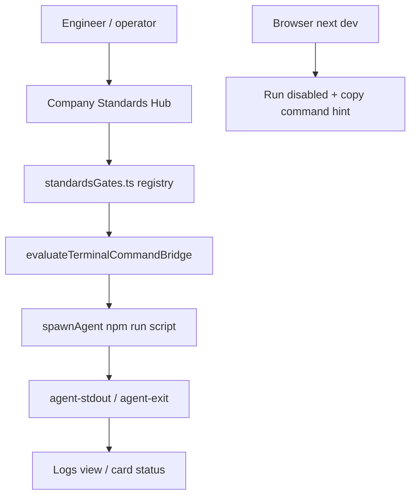

# F43: Company Standards Gates One-Click Execution

## Purpose

Engineers use the **Company Standards Hub** (`/company-standards`) to see which executable governance gates apply to Project Manager before shipping standards-sensitive work. Today the **Current project gates** section is a **static command map** — cards show `npm run …` but nothing runs in-app. F43 adds **Run** and **Run blocking gates** in the Tauri desktop app so operators can verify gates without leaving the hub, while preserving the intentional boundary: **catalogued checks only**, not a terminal emulator.

## Background

### Local evidence

| Surface | Current behavior | Gap |
| --- | --- | --- |
| `CompanyStandardsView` | `STANDARDS_GATES` constant; `StandardsGateCard` renders label, status, command, tags | No Run control; section title says checks are not run here |
| `MainClient` | `handleRunStart`, `activeRuns`, Tauri `agent-stdout/stderr/exit` | Company Standards view receives only `dashboardScopeProjects` — no run callbacks |
| `package.json` | `standards:check`, `docs:check` exist | UI shows `npm run i18n:check` but **no** `i18n:check` script; actual check is `node scripts/check-ui-i18n.mjs` via `verify-baseline.sh` |
| Cron / Features | `spawnAgent({ command, args, workingDir })` + Logs | Proven pattern for captured stdout |
| F41 | `npm run <script>` whitelist + `validateNpmRunScript` | Gates must use registered scripts only |
| Plugin contract (draft) | `standards.check.run` structured output | Future Phase 2; v1 uses npm scripts + exit code |
| Product docs | `company-standards.md` lists gates as “not a shell runner” | Must update after F43 ships |

### Product positioning

**Execution order (Run blocking gates, default):**

1. `i18n` gate (`npm run i18n:check`)
2. `standards` gate (`npm run standards:check`)
3. `docs` gate (`npm run docs:check`)

Skip `color-drift` (P2 advisory, non-blocking). Stop after first non-zero exit unless OD-02 resolves continue-on-fail.

## Glossary

| Term | Definition |
| --- | --- |
| Gate | A registered standards check with stable `id`, human label, and fixed invocation. |
| Blocking gate | Gate tagged blocking; included in **Run blocking gates**. |
| Advisory gate | Non-blocking follow-up (e.g. color-token drift); not in run-all v1. |
| PM repo root | Working directory for gate execution (Project Manager install root). |
| Gate run | Single spawn of one gate’s npm script with streamed logs. |

## User Stories

| ID | Story |
| --- | --- |
| US-01 | As an **engineer**, I want to run `i18n:check` from the hub so that I can fix hardcoded CJK copy without opening a separate terminal. |
| US-02 | As an **engineer**, I want **Run blocking gates** so that I can preflight standards-sensitive changes in one action before handoff. |
| US-03 | As an **operator**, I want pass/fail visible on each card so that I know which gate failed without reading the full log first. |
| US-04 | As an **operator**, I want output in **Logs** (or inline tail) so that I can diagnose checker failures like in Cron jobs. |
| US-05 | As a **security reviewer**, I want only registry-defined commands to run so that the hub cannot become an arbitrary shell. |
| US-06 | As a **browser dev user**, I want Run disabled with a clear message so that I do not assume `next dev` has OS spawn ability. |
| US-07 | As a **follow-up engineer**, I want specs and scenarios so that I can add plugin `standards.check.run` without rewriting the UI contract. |
| US-08 | As a **standards owner**, I want `i18n:check` in `package.json` so that displayed commands match runnable scripts. |

## Functional Requirements

### Gate registry

- FR-01: `lib/companyStandards/standardsGates.ts` exports `STANDARDS_GATES_REGISTRY` with fields: `id`, `label`, `npmScript`, `blocking`, `statusTone`, `scope`, `detail`, `tags`, `iconKey`.
- FR-02: View imports registry (or thin adapter) instead of duplicating a separate `STANDARDS_GATES` constant with divergent commands.
- FR-03: Add `package.json` script `"i18n:check": "node scripts/check-ui-i18n.mjs"`.

### Per-gate Run (Tauri)

- FR-04: Each blocking gate card shows **Run** when `isTauri()`; disabled while that gate is `running`.
- FR-05: On Run: evaluate `npm run <script>` via `evaluateTerminalCommandBridge`; on block, show error toast/inline message (no spawn).
- FR-06: On allow: `spawnAgent({ command: 'npm', args: ['run', script], workingDir: pmRepoRoot })` after **F44 execution policy** passes (assistant permission, CLI exposure, terminal boundaries). Register run with featureId `gate:<id>`.
- FR-07: On `agent-exit`, update card state to `pass` (code 0) or `fail` (non-zero); persist last run timestamp optional v1.1.

### Run blocking gates

- FR-08: Section header action **Run blocking gates** runs blocking gates **serially** in registry order.
- FR-09: While serial run active, disable per-gate Run and run-all button.
- FR-10: If a gate fails, default **stop** serial run and mark remaining gates `skipped` or `idle` (see OD-02).

### Browser / dev mode

- FR-11: In non-Tauri mode, Run and Run-all are disabled with helper text: use desktop app or terminal.
- FR-12: Optional: **Copy command** on each card (clipboard) — does not execute.

### Logs and observability

- FR-13: Gate runs appear in Logs / `activeRuns` with recognizable `featureName` (gate label).
- FR-14: Zero silent failures on spawn errors — surface message to user.

### Copy and docs

- FR-15: Update section header copy from “without running shell commands” to “guarded execution of registered gates only”.
- FR-16: Update `docs/guides/features/company-standards.md` gates section and “does NOT do” table.

## Technical Requirements

- TR-01: Bridge discipline — components call `lib/bridge` wrappers only, not `@tauri-apps/api` directly.
- TR-02: No `useState(localStorage…)` for gate run state; run state from props/events in `MainClient` or local component state hydrated after mount for **last results cache** only if needed.
- TR-03: `pmRepoRoot` resolved once (e.g. `process.cwd()` equivalent via constant or bridge helper used elsewhere — align with `CompanyStandardsView` `PROJECT_ROOT` constant pattern or dynamic from app config).
- TR-04: i18n: all new user-visible strings in `lib/i18n` (en + zh-Hant minimum).
- TR-05: Tests: registry validation, script existence, UI Run disabled in jsdom, mock spawn path.
- TR-06: Do not add `app/api/**` route for gate execution (static export / ADR).
- TR-07: `standards:check` may fail on machines without Company-AI-App-Standards path — UI shows fail + log; no fake pass.

## Acceptance Criteria

1. F43 appears in Project Dashboard > Development with artifact links and `in_progress` status.
2. Tauri: user can Run `i18n:check`, `standards:check`, `docs:check` individually; exit code reflected on card.
3. Tauri: **Run blocking gates** runs three blocking gates serially; stops on first failure (unless OD-02 changes).
4. Browser dev: Run controls disabled with explanation.
5. `npm run i18n:check` exists and matches checker used in `verify-baseline.sh`.
6. Focused tests green; `npm run docs:check` after doc edits; manual smoke documented in dev-log before claiming 100%.
7. No arbitrary shell input on Company Standards page.

## Open Decisions

| ID | Question | Default |
| --- | --- | --- |
| OD-01 | Inline log tail on card vs Logs-only? | Logs-only v1; optional 5-line tail v1.1 |
| OD-02 | Continue serial run after first failure? | Stop on first fail |
| OD-03 | Cache last pass/fail in localStorage across sessions? | No v1; session-only in React state |
| OD-04 | Run advisory `color-drift` gate? | Single Run disabled v1 (script not npm); document copy-only |

## Out of Scope (Phase 2+)

- `standards.check.run` plugin integration and P0/P1/P2 parsed summaries on metric cards.
- Per-selected-project cwd for multi-repo gate runs.
- CI invocation from hub.
