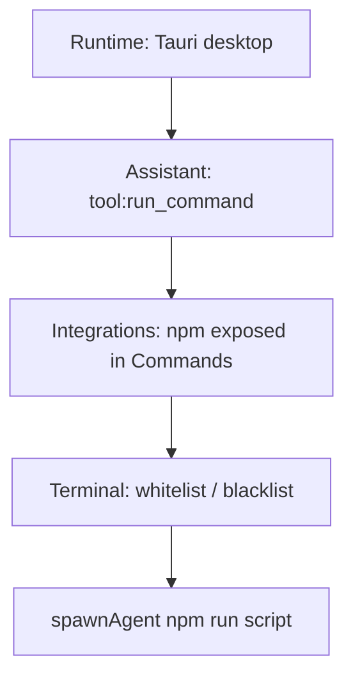

# F44: Execution Policy Integration

## Purpose

Operators hit **three separate gates** when running shell work from Project Manager: Integrations Hub **System CLI exposure**, AI Assistants **Permissions** (`tool:run_command`), and **Terminal Operational Boundaries** (whitelist/blacklist). F43 initially bypassed the CLI layer for standards gates — that contradicts the security model. F44 makes **Company Standards gate runs** evaluate all applicable layers in order and surface **actionable remediation** per failure.

## Policy stack (canonical order)

| Order | Layer | Source | Blocks when |
| --- | --- | --- | --- |
| 1 | Runtime | `isTauri()` | Browser dev / static preview |
| 2 | Assistant permission | `loadAIAssistantsConsoleState()` → selected assistant | `tool:run_command` is **blocked** |
| 3 | System CLI exposure | `listGlobalCliInventory` + `loadSystemCliExposureMap()` | `npm` is inventoried and **not exposed** |
| 4 | Terminal boundaries | Assistant `terminalBoundaries` or defaults | Command line not **allowed** (blacklist wins) |
| 5 | Bridge terminal eval | `evaluateTerminalCommandBridge` | Tauri Rust disagrees with TS (defense in depth) |

**Guarded** `tool:run_command`: operator clicking **Run** on a gate card counts as explicit confirmation — **guarded** and **granted** both pass for standards gates (chat tool cards still require Approve & Run).

## User Stories

| ID | Story |
| --- | --- |
| US-01 | As an **operator**, I want gate Run to fail with “enable npm in Commands” so I know it is policy, not a missing install. |
| US-02 | As an **operator**, I want gate Run to fail with “grant tool:run_command” so assistant policy matches my intent. |
| US-03 | As an **operator**, I want terminal blacklist failures to cite **Terminal Operational Boundaries** so I align with F41. |
| US-04 | As a **security reviewer**, I want no bypass of System CLI inventory for registry gates. |
| US-05 | As a **follow-up engineer**, I want one module (`executionPolicy.ts`) to extend to Cron/Dispatch later. |

## Functional Requirements

- FR-01: Remove `skipSystemCliInventoryCheck` from `SpawnAgentOptions` and all call sites.
- FR-02: `assertStandardsGateExecutionAllowed(gateId)` returns structured failure `{ layer, messageKey, detail? }`.
- FR-03: `spawnStandardsGateRun` calls assert before `spawnAgent`.
- FR-04: MainClient maps failure keys to i18n strings with remediation lines.
- FR-05: `docs/guides/features/execution-policy.md` documents the five layers and links to Hub / Console / F41.
- FR-06: Update F43 `feature-spec.md` FR-06 to reference F44 stack (no bypass).
- FR-07: Unit tests cover permission blocked, npm not exposed, terminal blocked, happy path mocked.

## Acceptance Criteria

1. With `npm` not exposed, gate Run shows Commands remediation (reproduces user report, fixed path).
2. With `tool:run_command` blocked, gate Run shows Permissions remediation.
3. With terminal blacklist hit, gate Run shows Terminal Boundaries remediation.
4. All three enabled + granted → gate spawns without System CLI bypass.
5. `npm run verify:baseline` passes; F44 artifacts and dev-log updated.

## Open Decisions

| ID | Decision | Choice |
| --- | --- | --- |
| OD-01 | New scope `tool:run_standards_gate`? | Defer — reuse `tool:run_command` for v1 |
| OD-02 | Project-scoped permission JSON | Defer — console localStorage (F41 S5 sidecar for boundaries only) |
