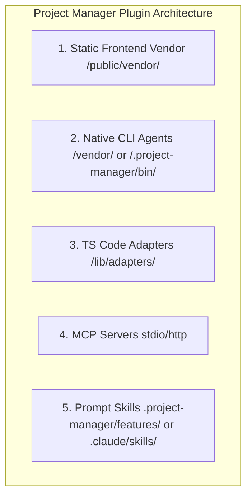

# Project Manager Plugin Guide — Usage and Classification

> **Created Date**: 2026-05-21
> **Created By**: AI Agent
> **Document Type**: Engineering Spec & User Guide
> **Version**: 1.0
> **Target Path**: `docs/engineering/plugin-guide.md`

---

## English Version

This guide outlines the classification, directory layout standards, and usage of plugins in the Project Manager ecosystem. To ensure performance, security, and independent upgradeability, our system enforces a strict **Three-Tier Plugin Architecture** supplemented by MCP Servers and Custom Skills.

---

### 1. The Three-Tier Plugin Architecture

To balance performance, UI rendering, system-level safety, and type safety, plugins in this project are strictly categorized into three tiers of integration:

#### Tier 1: Static Frontend Vendor Plugins (`/public/vendor/`)
*   **Purpose**: Heavy third-party client-side rendering packages (e.g., `mermaid`, code editors, plotting libraries).
*   **Storage**: `/public/vendor/<plugin-name>/`
*   **Execution**: Rendered within isolated sandboxed `<iframe>` tags (without `allow-same-origin`) or dynamic script loading.
*   **Why**: Prevents bloated Next.js webpack bundles, avoids long compilation times, isolates third-party CSS, and safeguards against XSS scripts attacking the Tauri shell or OS Keychain.

#### Tier 2: Native CLI Agents and Binaries (`/.project-manager/bin/` or `/vendor/`)
*   **Purpose**: Background executables, terminal-spawned agent CLIs, gateways.
*   **Storage**: `/.project-manager/bin/` (or `/vendor/` for shared components)
*   **Execution**: Spawned as sidecars or sub-processes by Tauri's Rust core, communicating via stdin/stdout or local TCP ports.
*   **Why**: Sandboxes file execution and keeps heavy backend node/python packages from bloating the static web UI.

#### Tier 3: TypeScript Code Adapters (`/lib/adapters/` or `/lib/bridge-plugins/`)
*   **Purpose**: Structural integrations requiring direct access to global states, React context, or Tauri invoke bridge.
*   **Storage**: `lib/adapters/` (e.g., `local-ide-adapter.ts`, `agent-adapter.ts`)
*   **Execution**: Standard TypeScript modules imported at build time.
*   **Why**: Enforces static compile-time type safety across various IDE configurations and agent runtimes.

---

### 2. Model Context Protocol (MCP) Servers

*   **Purpose**: Stdio-based or HTTP-based microservices implementing the Model Context Protocol.
*   **Execution**: Spawns and stops dynamically under Tauri control. Configured via the `mcp_config.json` temp file passed to underlying CLI agents.
*   **Lifecycle**: Users can start, stop, restart, and inspect live stdout/stderr/logs directly from the UI.

---

### 3. Modular Prompt Skills

*   **Purpose**: Lightweight, domain-specific AI workflows and rule guides in `.md` format.
*   **Storage**: Local folder matching the active workspace context or `.project-manager/features/<ID>/`.

---

## 中文版本

本指南說明 Project Manager 生態系中的外掛分類、目錄佈局標準與使用方法。為保障應用程式效能、執行安全與獨立升級能力，本系統強制採用**「三維度外掛架構」**，並輔以 MCP 伺服器與自定義技能模組。

---

### 1. 三維度外掛架構 (The Three-Tier Plugin Architecture)

為兼顧網頁載入效能、安全性與型別檢查，本專案的外掛依整合層級劃分為三個核心維度：

#### 第一維度：前端靜態外掛 (Static Frontend Vendor Plugins)
*   **定位**：體積龐大的第三方前端渲染套件（如 `mermaid` 圖表、Monaco 編輯器、PDF 閱讀器）。
*   **存放路徑**：`/public/vendor/<plugin-name>/`
*   **載入方式**：利用獨立沙盒 `<iframe>`（不配置 `allow-same-origin`）或動態 Script 載入。
*   **優勢**：防止 Next.js webpack 編譯打包膨脹、縮短 50% 構建時間、隔離第三方 CSS，並建立 XSS 防火牆，阻斷任意圖表腳本獲取 Tauri 與系統 Keychain 權限。

#### 第二維度：本機二進位執行檔與代理 CLI (Native CLI Agents & Binaries)
*   **定位**：背景執行檔、終端代理 CLI（如 `claude-code`, `openclaw`, `hermes`）。
*   **存放路徑**：`/.project-manager/bin/` (或 `/vendor/` 供共享組件)
*   **載入方式**：由 Tauri Rust 核心作為 Sidecar 啟動並監管，透過 stdio 或本地 TCP 通訊。
*   **優勢**：完全不佔用前端打包體積，保障本機環境與敏感檔案存取之安全性。

#### 第三維度：TypeScript 代碼級適配器 (TypeScript Code Adapters)
*   **定位**：需要與主程式 React 狀態、全局上下文（Context）或 Tauri 呼叫橋接器直接互動的程式碼整合。
*   **存放路徑**：`lib/adapters/` 或 `lib/bridge-plugins/`
*   **載入方式**：於構建期標準模組導入（ES Module Import）。
*   **優勢**：提供最強的編譯期型別安全檢查，確保與 React 生命週期完美對齊。

---

### 2. 模型上下文協定 (MCP) 伺服器

*   **定位**：實現 Model Context Protocol 的微服務。
*   **管理**：在 UI 介面上提供獨立的 **MCP 管理面板**。用戶可直接執行「啟動、停止、重啟」操作，並能即時調閱 stdout/stderr 運作日誌。

---

### 3. 模組化技能 (Skills)

*   **定位**：人讀或 AI 讀取的輕量化工作規格、TDD 驗證及提示詞指南（`.md` 格式）。
*   **存放**：存在工作區專屬目錄，或存放於 `.project-manager/features/<ID>/`。
