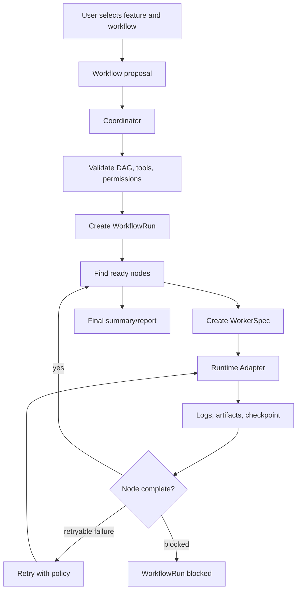
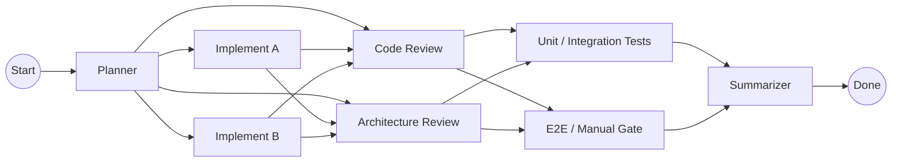
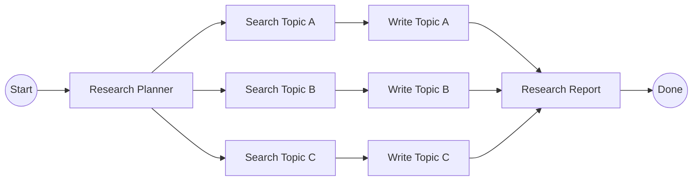
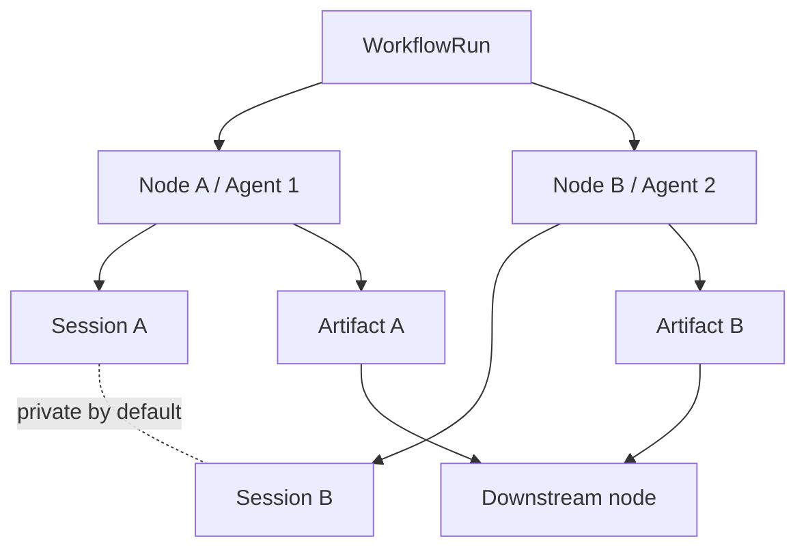

# Agent Workflows

Agent Workflows are reusable multi-agent business processes. They describe how Project Manager should split work into AI Engineer roles, run workers in dependency order, isolate memory, collect artifacts, and summarize the result.

The first workflow templates are Software Development and Deep Research. Both use a DAG: a directed acyclic graph where nodes can run after their dependencies complete.

## Core concepts

| Concept | Meaning |
|---|---|
| Coordinator | The Project Manager control-plane service that schedules nodes, creates workers, tracks state, retries failures, and records artifacts. |
| Workflow | A named process template such as Software Development or Deep Research. |
| DAG | A dependency graph with no cycles. It defines which steps can run in parallel and which steps must wait. |
| Node | One step in a workflow. A node declares role, dependencies, runtime, tools, memory policy, retry policy, and required output. |
| AI Engineer | The role assigned to a node. It supplies prompt, provider, model, skills, scope, and capabilities. |
| Worker | The runtime instance that runs one node for one AI Engineer. |
| Runtime Adapter | The execution provider behind a worker, such as local/xmux now or CubeSandbox/E2B later. |
| Tool Bundle | The tools, skills, memory sources, plugins, MCP servers, and capability candidates a worker may use. |
| Artifact | A declared output from a node. Downstream nodes should consume artifacts, not hidden sibling transcripts. |
| Checkpoint | Restorable state for retry or resume. |

## Control-plane lifecycle

## Software Development workflow

The Software Development workflow is for feature implementation with parallel work and review gates.

| Stage | What happens | Required evidence |
|---|---|---|
| Planner | Reads the feature request and code context, then splits the work. | Implementation plan and verification matrix. |
| Implementers | Make scoped code changes in parallel. | Diff summary and focused verification output. |
| Reviewers | Review implementation and architecture boundaries. | Severity-ordered findings and open questions. |
| Testers / Evaluators | Run unit, integration, E2E, or manual verification. | Commands, pass/fail results, and failure evidence. |
| Summarizer | Reads declared artifacts and produces handoff. | Final summary, residual risk, and next steps. |

## Deep Research workflow

The Deep Research workflow is for parallel research, synthesis, and report generation.

| Stage | What happens | Required evidence |
|---|---|---|
| Research Planner | Defines topics, source criteria, and output shape. | Research brief and branch plan. |
| Search Workers | Gather sources and notes for one topic each. | Source notes, citations, and uncertainty notes. |
| Writer Workers | Draft topic sections from approved source notes. | Topic drafts with source references. |
| Report Worker | Merges topic drafts into final report. | Final report, source summary, confidence notes. |

## Dispatch flow

When Dispatch supports workflows, the user path should be:

1. Select a feature from Development Progress in the Project Progress Dashboard.
2. Choose a workflow template: Software Development, Deep Research, or a custom template.
3. Confirm AI Engineer role assignments for each node group.
4. Confirm provider/model and runtime preferences.
5. Review tool bundle and memory scopes.
6. Start in dry-run, guarded, or approved execution mode.
7. Open AI Assistants Control Console > Workflow Runs to inspect the persisted run.
8. Monitor node status, artifacts, logs, and checkpoints.

The Coordinator should block a workflow before runtime start if a required tool candidate, provider key, model, path permission, or memory policy is missing.

## Memory and artifacts

Worker sessions are isolated by default.

Rules:

- Session keys include project, workflow, run, node, and agent identity.
- Downstream nodes consume declared artifacts by default.
- Sibling worker transcripts require explicit sharing policy.
- Summarizers should report what artifacts they consumed.
- Resume must use the exact checkpoint for the selected node and agent.

## Runtime adapters

F35 treats runtime providers as replaceable adapters. The workflow definition says what should run; the adapter decides how to run it.

| Runtime | Intended use |
|---|---|
| local / xmux | Current local developer workflow and pane/session orchestration. |
| CubeSandbox | Future isolated worker runtime with fast VM startup and pause/resume potential. |
| E2B | Future hosted sandbox provider behind the same adapter contract. |
| Hermes / OpenClaw | Future agent/service integrations when they expose compatible run/session semantics. |

Runtime-specific fields should stay inside adapter configuration. User-authored workflow definitions should remain portable.

## Current status

Implemented now:

- Built-in Software Development and Deep Research DAG definitions.
- DAG validation for duplicate IDs, dangling edges, missing dependencies, and cycles.
- WorkflowRun and WorkflowNodeRun state helpers for ready/queued/running/completed/blocked flow.
- Dispatch and Batch Dispatch template pickers for multi-agent DAG workflows.
- WorkflowRun sidecar persistence under `.project-manager/workflow-runs/*.json`.
- AI Assistants Control Console > Workflow Runs sheet for browsing persisted sidecars, node status, session scope, runtime profile, and artifacts.
- Per-worker session scope and path-safe store keys.
- Tool bundle references without raw sensitive values.
- F35 feature spec, TDD spec, user scenarios, and dev log.

Planned next:

- Integrations Hub tool/capability resolver.
- Runtime adapter interface and local/xmux worker runner.
- Workflow Runs controls for retry, resume, cancellation, checkpoint restore, permissions, and audit events.

## Related guides

- [AI Assistants Control Console](ai-assistants-control-console.md)
- [AI Engineers](engineers.md)
- [AI Assistant](chat.md)
- [Integrations Hub](integrations-hub.md)
