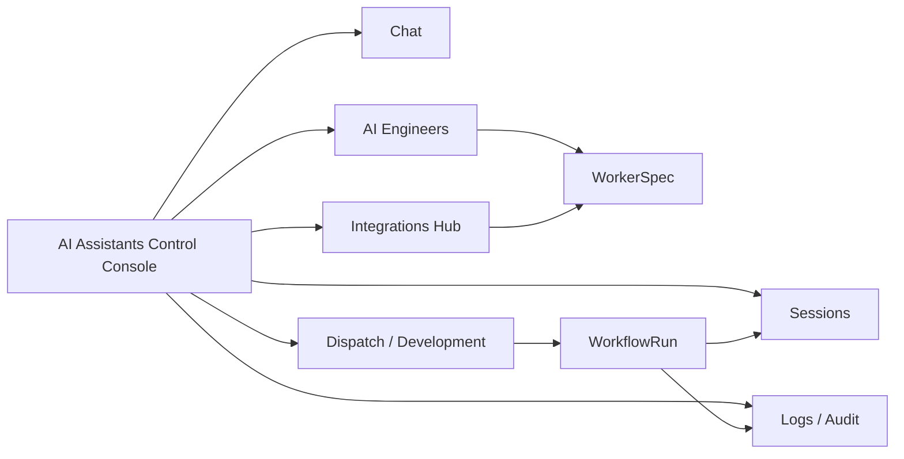

# AI Assistants Control Console

The AI Assistants Control Console is Project Manager's mission control surface for assistant instances, engineer roles, workflow supervision, permissions, memory, jobs, and audit history.

The floating AI Assistant and the standalone chat page are conversation surfaces. The Control Console is broader: it explains what the assistant is allowed to know, which AI Engineers it can dispatch, which skills and memories are available, and what happened during a workflow run.

## Console areas

| Area | What you inspect or control | Why it matters |
|---|---|---|
| Chat | Active conversation with the selected assistant. | Ask questions, draft workflow proposals, and inspect selected project context. |
| Overview | Assistant identity, runtime health, active state, terminal command boundaries, and recent jobs. | Confirms whether the assistant is idle, running, blocked, or degraded; shows whitelist/blacklist rules for shell execution. |
| AI Engineers | Role definitions used by dispatch and workflow nodes. | Controls role name, prompt, model, fallback chain, skills, working scope, and capabilities. |
| Profiles | Assistant profile source and behavior defaults. | Separates general assistant personality from role-specific AI Engineer instructions. |
| Skills / Memory | Context sources available to assistants and workers. | Shows whether context is global, project-scoped, role-scoped, or worker-scoped. |
| Workflow Runs | Persisted DAG runs created by Dispatch. | Shows run status, node readiness, worker session scope, runtime profile, and artifacts. |
| Dreaming / Jobs | Offline proposal generation and background work. | Produces proposals and artifacts without silently changing project config. |
| Permissions | Tool, command, file, network, and memory-write approvals. | Blocks risky work before a worker starts. |
| Audit | Who changed or accessed what, when, and why. | Makes workflow creation, retry, resume, cancellation, and memory reads reviewable. |

## How it relates to other views

The Console should answer these operator questions:

- Which assistant or AI Engineer is about to act?
- Which provider and model will it use?
- Which tools, skills, memories, and files can it access?
- Which workflow node is running or blocked?
- Which session store and checkpoint will be used if it resumes?
- Which artifacts were produced, and which logs prove the result?

## Key terms

| Term | Meaning |
|---|---|
| Assistant Instance | A user-facing assistant with chat state, profile, and permissions. |
| AI Engineer | A reusable role definition that can be assigned to workflow nodes. |
| Worker | One runtime instance created to run one workflow node. |
| Profile Source | The assistant-level configuration that shapes general behavior. |
| Skill Source | A project skill, MCP tool, plugin, command, or capability candidate that a worker may use. |
| Memory Scope | The boundary that decides where durable context can be read or written. |
| Dreaming Job | Background proposal generation that creates reviewable artifacts. |
| Permission | A rule that allows, blocks, or requires confirmation for a risky action. |
| Terminal Operational Boundaries | Whitelist/blacklist policy that constrains which shell commands an assistant may execute in the user's system terminal. |
| Audit Event | A durable record of config, workflow, permission, memory, or runtime activity. |
| Worker Run | One node execution with a selected role, model, runtime, tool bundle, and session scope. |

## Operating workflow

1. Open the Console and confirm the selected project and assistant.
2. Review the AI Engineer role that will be used for the work.
3. Confirm provider, model, fallback chain, skills, capabilities, and working scope.
4. Review Skills / Memory to make sure the worker will not inherit unrelated context.
5. Check Permissions for blocked tools, commands, file paths, and memory writes.
6. Start or inspect a workflow proposal from Chat, Dreaming / Jobs, or Dispatch.
7. Open Workflow Runs to inspect persisted run/node state from `.project-manager/workflow-runs/*.json`.
8. Monitor active workers in Overview and read evidence in Sessions, Logs, and Audit.

## Workflow Runs sheet

The Workflow Runs sheet is the first visible F35 control-plane surface. It reads the selected project's `.project-manager/workflow-runs/*.json` sidecars and summarizes:

- total runs, active runs, ready nodes, completed runs, and blocked runs;
- each run's workflow template, feature ID, status, node counts, and update time;
- selected run detail with every node's role, status, dependencies, attempts, runtime provider, isolated session scope, and output artifacts.

Use this sheet after Dispatch creates a DAG workflow run. It is currently a read surface; retry, resume, cancel, and live scheduler actions belong to the next runtime-adapter slices.

## Terminal Operational Boundaries (Overview)

The Overview sheet exposes **Terminal Operational Boundaries** — a default-deny whitelist/blacklist framework for AI assistant shell execution in the user's system terminal.

| List | Purpose |
|---|---|
| Whitelist | Explicitly permitted safe commands (inspection, read-only git, package scripts, compile checks). |
| Blacklist | Always-blocked high-risk patterns (recursive delete, privilege escalation, permission mutation, remote pipe-to-shell, credential reads). |

Evaluation order: normalize input → match blacklist (wins) → match whitelist → apply policy mode. Unknown commands are blocked under default-deny.

Full permission scopes (`profile:read`, `tool:run_command`, etc.) remain on the **Permissions** sheet; terminal boundaries focus only on command-pattern safety.

When `tool:run_command` is **guarded**, chat shows **Approve & Run** on the tool card before execution proceeds. Blocked commands enqueue **Blocked Command Review Queue** items on Overview for whitelist/blacklist review.

## Memory isolation rules

Worker memory must be explicit and scoped. A worker should not inherit another worker's hidden transcript just because both workers belong to the same workflow.

| Scope | When to use it | Default access |
|---|---|---|
| Global assistant memory | Stable product preferences and general operator preferences. | Assistant chat only, not worker runs by default. |
| Project memory | Project instructions, architecture notes, and standards. | Available when selected by workflow or role. |
| Role memory | Durable role-specific behavior notes. | Available to workers using that AI Engineer role. |
| Workflow-run memory | Shared run-level decisions approved by the Coordinator. | Available to declared downstream nodes. |
| Worker session | Transcript and checkpoint for one node + agent. | Private to that worker unless explicitly shared. |

For multi-agent DAG workflows, the session key must include project, workflow, run, node, and agent identity. Downstream summarizers should consume declared artifacts by default, not private sibling transcripts.

## Safety expectations

- The Console may draft changes, but it should not silently mutate role definitions, memory, permissions, or workflow templates.
- Secrets and API keys are referenced by configured provider state, never shown as raw values.
- Missing provider, missing model, missing capability, blocked permission, and degraded runtime states must be visible.
- Retrying or resuming a worker must show the exact checkpoint and session scope.
- Audit should record workflow create, start, retry, resume, cancel, permission decision, memory read, and memory write events.

## Current status

The current implementation already has chat, AI Engineers, provider/model selection, capability assignment, sessions, logs, F35 workflow DAG contracts, Dispatch DAG template selection, WorkflowRun sidecar persistence, and a Workflow Runs sheet for browsing persisted DAG state. The next product step is to add runtime adapters and live scheduler controls.

## Related guides

- [AI Assistant](chat.md)
- [AI Engineers](engineers.md)
- [Agent Workflows](agent-workflows.md)
- [Integrations Hub](integrations-hub.md)
