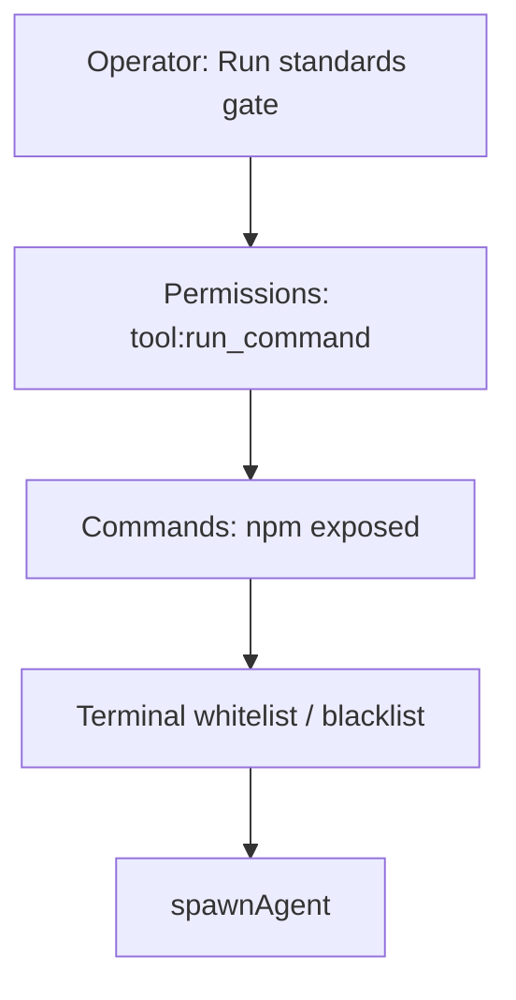

# Execution Policy

Project Manager runs local commands through several **independent policy layers**. Surfaces such as **AI Assistants chat**, **Integrations Hub → Run command**, **Cron jobs**, and **Company Standards gates** all eventually call `spawnAgent`, but each surface should pass the same checks in the same order.

## Policy stack

| Order | Layer | Where to configure | What it controls |
| --- | --- | --- | --- |
| 1 | **Runtime** | Use the Tauri desktop app | Browser `next dev` cannot spawn real processes |
| 2 | **Assistant permission** | AI Assistants → **Permissions** | `tool:run_command` — blocked / guarded / granted |
| 3 | **System CLI exposure** | Integrations Hub → **Commands** (or Settings → AI CLI Preset) | Whether inventoried binaries such as `npm` may be invoked |
| 4 | **Terminal boundaries** | AI Assistants → **Overview** → Terminal Operational Boundaries | Whitelist / blacklist command **patterns** (F41) |
| 5 | **Bridge evaluation** | Automatic in Tauri | Rust terminal evaluator (defense in depth) |

## Company Standards gates (F43 + F44)

**Current project gates** on `/company-standards` run registry scripts (`npm run i18n:check`, `standards:check`, `docs:check`) through the full stack above.

| Failure message theme | Fix |
| --- | --- |
| Permission blocked | AI Assistants → Permissions → set **tool:run_command** to Granted or Guarded |
| npm not exposed | Integrations Hub → Commands → enable **npm**, or Settings → apply AI CLI Preset |
| Terminal blocked | AI Assistants → Overview → adjust whitelist/blacklist (e.g. allow `npm run <script>`) |

Clicking **Run** on a gate card counts as operator confirmation, so **guarded** permission is enough (chat still shows Approve & Run for tool cards).

## How this relates to other features

| Development ID | Progress (dashboard) | Role in execution policy |
| --- | --- | --- |
| **F41** Terminal boundaries | Done | Whitelist / blacklist on Overview |
| **F44** Execution policy integration | In progress | Unifies layers for standards gates |
| **F43** Standards gate Run UI | In progress | Operator Run buttons |
| **F42** Chat security boundary | ~90% | Provider keys; separate from shell policy |
| **F35** Workflow DAG | ~84% | AI Engineers + Workflow Runs; runtime adapters pending |
| **F39** Plugin install control | ~10% | Hub catalog / autostart; not shell spawn |
| Integrations Hub sheets | Ongoing | Commands exposure (F19–F24, F33, …) |

| Guide | Role |
| --- | --- |
| [Integrations Hub](./integrations-hub.md) | Discovers CLIs on PATH; Commands sheet toggles exposure |
| [AI Assistants Control Console](./ai-assistants-control-console.md) | Permissions + Terminal Operational Boundaries |
| [Company Standards](./company-standards.md) | Gate registry and Run actions |
| F35 Agent workflows | Future: same policy helper for worker spawns |

## Implementation reference

- Policy evaluation: `lib/companyStandards/executionPolicy.ts`
- Gate spawn: `lib/companyStandards/spawnStandardsGate.ts`
- Development features: **F44** (integration), **F41** (boundaries), **F43** (gate UI)

## Related guides

- [Integrations Hub](./integrations-hub.md) — Commands sheet
- [AI Assistants Control Console](./ai-assistants-control-console.md) — Permissions and Overview boundaries
- [Company Standards](./company-standards.md) — Gate map and Run buttons
