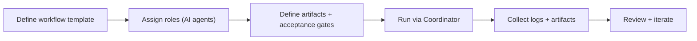
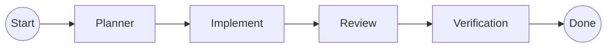

# Coordinator + AI Agents framework

## Pain scenario

Even when a team uses AI regularly, workflows tend to be ad-hoc:

- Every engineer invents their own prompt and process.
- Cross-project processes (refactors, audits, migrations) are hard to reuse.
- Delegation is implicit (“go do X”) rather than explicit (“produce artifacts A/B/C”).

## Project Manager solution

Project Manager enables structured, reusable execution via:

- Coordinators that split work, manage dependencies, and enforce guardrails.
- Built-in and user-defined AI Agents for repeatable roles (planner, implementer, reviewer, tester).
- Declared artifacts and run summaries so outcomes are durable and auditable.

## Implementation flow

### Steps

1. Start with one repeatable workflow (for example: “feature implementation with review and verification”).
2. Define the required artifacts (spec updates, diffs, verification output, release notes).
3. Encode guardrails (scope limits, approval gates, verification requirements).
4. Use the Coordinator to run roles in a predictable order and persist outputs.

## Visual aids

### Workflow DAG (illustration)

### Role + artifact contract (illustration)

<svg viewBox="0 0 900 380" width="100%" role="img" aria-label="Illustrated role and artifact contract for a coordinator-managed workflow.">
  <rect x="0" y="0" width="900" height="380" rx="14" fill="#0b0f19" />
  <rect x="18" y="18" width="864" height="344" rx="12" fill="#111827" />

  <text x="40" y="52" fill="#e5e7eb" font-size="14" font-family="system-ui, -apple-system, Segoe UI, Roboto">Workflow contract</text>
  <text x="40" y="76" fill="#9ca3af" font-size="12" font-family="system-ui, -apple-system, Segoe UI, Roboto">Roles produce declared artifacts</text>

  <rect x="40" y="96" width="250" height="260" rx="12" fill="#0f172a" stroke="#1f2937" />
  <text x="58" y="126" fill="#e5e7eb" font-size="12" font-family="system-ui, -apple-system, Segoe UI, Roboto">Roles</text>
  <rect x="58" y="140" width="214" height="34" rx="10" fill="#111827" stroke="#1f2937" />
  <text x="70" y="162" fill="#e5e7eb" font-size="12" font-family="system-ui, -apple-system, Segoe UI, Roboto">Planner</text>
  <rect x="58" y="184" width="214" height="34" rx="10" fill="#111827" stroke="#1f2937" />
  <text x="70" y="206" fill="#e5e7eb" font-size="12" font-family="system-ui, -apple-system, Segoe UI, Roboto">Implementer</text>
  <rect x="58" y="228" width="214" height="34" rx="10" fill="#111827" stroke="#1f2937" />
  <text x="70" y="250" fill="#e5e7eb" font-size="12" font-family="system-ui, -apple-system, Segoe UI, Roboto">Reviewer</text>
  <rect x="58" y="272" width="214" height="34" rx="10" fill="#111827" stroke="#1f2937" />
  <text x="70" y="294" fill="#e5e7eb" font-size="12" font-family="system-ui, -apple-system, Segoe UI, Roboto">Verifier</text>

  <rect x="310" y="96" width="572" height="260" rx="12" fill="#0f172a" stroke="#1f2937" />
  <text x="328" y="126" fill="#e5e7eb" font-size="12" font-family="system-ui, -apple-system, Segoe UI, Roboto">Artifacts & gates</text>
  <rect x="328" y="140" width="536" height="34" rx="10" fill="#111827" stroke="#1f2937" />
  <text x="342" y="162" fill="#e5e7eb" font-size="11" font-family="system-ui, -apple-system, Segoe UI, Roboto">Plan: steps + verification matrix</text>
  <rect x="328" y="184" width="536" height="34" rx="10" fill="#111827" stroke="#1f2937" />
  <text x="342" y="206" fill="#e5e7eb" font-size="11" font-family="system-ui, -apple-system, Segoe UI, Roboto">Diff: scoped code changes</text>
  <rect x="328" y="228" width="536" height="34" rx="10" fill="#111827" stroke="#1f2937" />
  <text x="342" y="250" fill="#e5e7eb" font-size="11" font-family="system-ui, -apple-system, Segoe UI, Roboto">Review: findings + open risks</text>
  <rect x="328" y="272" width="536" height="34" rx="10" fill="#111827" stroke="#1f2937" />
  <text x="342" y="294" fill="#e5e7eb" font-size="11" font-family="system-ui, -apple-system, Segoe UI, Roboto">Verify: commands + pass/fail evidence</text>
  <rect x="328" y="316" width="536" height="26" rx="10" fill="#064e3b" opacity="0.7" />
  <text x="342" y="334" fill="#d1fae5" font-size="11" font-family="system-ui, -apple-system, Segoe UI, Roboto">Gate: do not ship without verification</text>
</svg>

## Navigate

- Previous: [Live agent observability](./live-agent-observability)
- Next: [Real-time voice (ASR + TTS)](./realtime-voice-asr-tts)

