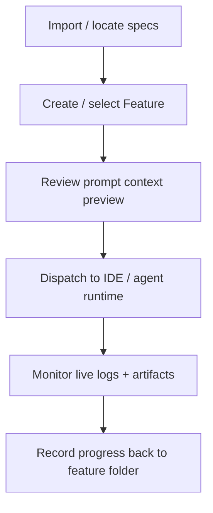

# Fragmented tools → One control surface

## Pain scenario

Engineering work is split across docs, trackers, terminals, and ad-hoc scripts. The team can execute tasks, but cannot reliably answer:

- What is the current plan for this feature?
- Which projects are blocked, and why?
- What is running right now, and what did it produce?

The result is context switching, duplicated coordination, and lost artifacts.

## Project Manager solution

Project Manager acts as a desktop mission-control surface that unifies:

- Specs and project context
- Feature/task selection and dispatch
- Execution monitoring and artifacts

Instead of “find the right tool first”, the workflow starts from a single operational surface.

## Implementation flow

### Steps

1. Consolidate “source of truth” documents per project (specs, policies, notes) into a discoverable structure.
2. Ensure each project has a `.project-manager` feature folder for artifacts and logs.
3. Use the dashboard to select a feature, preview the prompt context, then dispatch.
4. Observe output in live logs and persist artifacts into the feature folder.

## Visual aids

### Control-surface snapshot (illustration)

<svg viewBox="0 0 900 380" width="100%" role="img" aria-label="Illustrated dashboard surface that unifies specs, dispatch, and logs.">
  <rect x="0" y="0" width="900" height="380" rx="14" fill="#0b0f19" />
  <rect x="18" y="18" width="230" height="344" rx="10" fill="#111827" />
  <rect x="264" y="18" width="618" height="44" rx="10" fill="#111827" />
  <rect x="264" y="76" width="618" height="286" rx="10" fill="#111827" />

  <text x="34" y="48" fill="#e5e7eb" font-size="16" font-family="system-ui, -apple-system, Segoe UI, Roboto">Workspace</text>
  <text x="34" y="84" fill="#9ca3af" font-size="12" font-family="system-ui, -apple-system, Segoe UI, Roboto">Projects</text>
  <rect x="34" y="94" width="198" height="30" rx="7" fill="#0f172a" stroke="#1f2937" />
  <text x="44" y="114" fill="#e5e7eb" font-size="12" font-family="system-ui, -apple-system, Segoe UI, Roboto">Project A</text>
  <text x="34" y="148" fill="#9ca3af" font-size="12" font-family="system-ui, -apple-system, Segoe UI, Roboto">Artifacts</text>
  <rect x="34" y="158" width="198" height="30" rx="7" fill="#0f172a" stroke="#1f2937" />
  <text x="44" y="178" fill="#e5e7eb" font-size="12" font-family="system-ui, -apple-system, Segoe UI, Roboto">Specs</text>
  <rect x="34" y="194" width="198" height="30" rx="7" fill="#0f172a" stroke="#1f2937" />
  <text x="44" y="214" fill="#e5e7eb" font-size="12" font-family="system-ui, -apple-system, Segoe UI, Roboto">Features</text>
  <rect x="34" y="230" width="198" height="30" rx="7" fill="#0f172a" stroke="#1f2937" />
  <text x="44" y="250" fill="#e5e7eb" font-size="12" font-family="system-ui, -apple-system, Segoe UI, Roboto">Logs</text>

  <text x="284" y="46" fill="#e5e7eb" font-size="14" font-family="system-ui, -apple-system, Segoe UI, Roboto">Project Manager Control Surface</text>
  <rect x="274" y="92" width="598" height="74" rx="10" fill="#0f172a" stroke="#1f2937" />
  <text x="294" y="120" fill="#e5e7eb" font-size="12" font-family="system-ui, -apple-system, Segoe UI, Roboto">Specs + Context</text>
  <text x="294" y="144" fill="#9ca3af" font-size="11" font-family="system-ui, -apple-system, Segoe UI, Roboto">Auto-assembled prompt preview</text>

  <rect x="274" y="178" width="380" height="168" rx="10" fill="#0f172a" stroke="#1f2937" />
  <text x="294" y="208" fill="#e5e7eb" font-size="12" font-family="system-ui, -apple-system, Segoe UI, Roboto">Dispatch</text>
  <text x="294" y="232" fill="#9ca3af" font-size="11" font-family="system-ui, -apple-system, Segoe UI, Roboto">IDE / Agent runtime selection</text>
  <rect x="294" y="252" width="340" height="26" rx="7" fill="#111827" stroke="#1f2937" />
  <text x="306" y="270" fill="#e5e7eb" font-size="11" font-family="system-ui, -apple-system, Segoe UI, Roboto">Cursor · Claude · xmux</text>

  <rect x="666" y="178" width="206" height="168" rx="10" fill="#0f172a" stroke="#1f2937" />
  <text x="686" y="208" fill="#e5e7eb" font-size="12" font-family="system-ui, -apple-system, Segoe UI, Roboto">Observability</text>
  <text x="686" y="232" fill="#9ca3af" font-size="11" font-family="system-ui, -apple-system, Segoe UI, Roboto">Live logs + artifacts</text>
  <rect x="686" y="248" width="166" height="8" rx="4" fill="#065f46" />
  <rect x="686" y="266" width="150" height="8" rx="4" fill="#1f2937" />
  <rect x="686" y="284" width="172" height="8" rx="4" fill="#1f2937" />
  <rect x="686" y="302" width="128" height="8" rx="4" fill="#1f2937" />
</svg>

## Navigate

- Previous: [Overview](./)
- Next: [Multi-project multitasking](./multi-project-multi-task)

