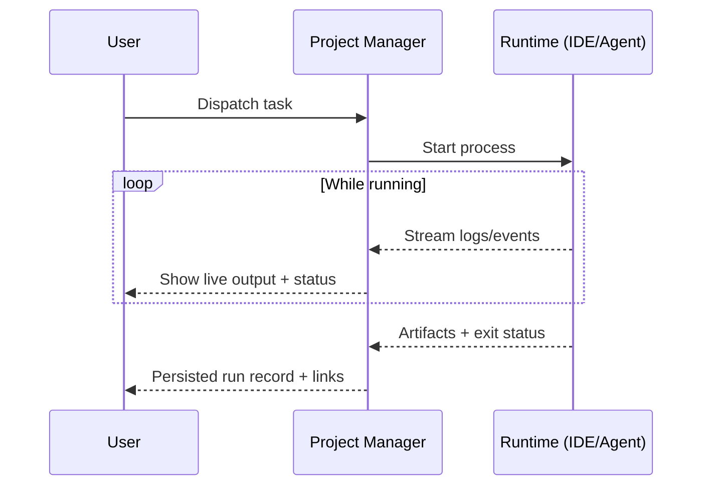

# Live agent observability

## Pain scenario

When AI agents run “somewhere else” (an IDE extension, a background process, a remote tool), teams lose visibility:

- You cannot see what is happening right now.
- Failures are discovered late, after minutes or hours.
- Artifacts and logs are scattered and hard to audit.

## Project Manager solution

Project Manager provides a built-in observability surface:

- Live log streaming while work is executing.
- Clear run status and the ability to stop a runaway process.
- A consistent place to find artifacts produced by the run.

## Implementation flow

### Steps

1. Treat every dispatch as a run with a stable identity (task, project, start time).
2. Stream logs in real time so users can catch failures early.
3. Capture artifacts in a predictable folder so audits are simple.
4. Provide a controlled stop/kill path when the run is wrong or stuck.

## Visual aids

### Live logs (illustration)

<svg viewBox="0 0 900 400" width="100%" role="img" aria-label="Illustrated live logs surface with streaming output and a stop button.">
  <rect x="0" y="0" width="900" height="400" rx="14" fill="#0b0f19" />
  <rect x="18" y="18" width="864" height="54" rx="12" fill="#111827" />
  <text x="40" y="52" fill="#e5e7eb" font-size="14" font-family="system-ui, -apple-system, Segoe UI, Roboto">Runs</text>
  <rect x="776" y="30" width="106" height="30" rx="10" fill="#7f1d1d" />
  <text x="804" y="50" fill="#fee2e2" font-size="12" font-family="system-ui, -apple-system, Segoe UI, Roboto">Stop</text>

  <rect x="18" y="86" width="864" height="296" rx="12" fill="#111827" />
  <rect x="40" y="112" width="820" height="244" rx="12" fill="#0b1220" stroke="#1f2937" />
  <text x="60" y="140" fill="#86efac" font-size="12" font-family="ui-monospace, SFMono-Regular, Menlo, Monaco, Consolas">[run] starting…</text>
  <text x="60" y="164" fill="#e5e7eb" font-size="12" font-family="ui-monospace, SFMono-Regular, Menlo, Monaco, Consolas">[ctx] loaded: feature-spec.md</text>
  <text x="60" y="188" fill="#e5e7eb" font-size="12" font-family="ui-monospace, SFMono-Regular, Menlo, Monaco, Consolas">[plan] steps: 6</text>
  <text x="60" y="212" fill="#e5e7eb" font-size="12" font-family="ui-monospace, SFMono-Regular, Menlo, Monaco, Consolas">[exec] applying patch…</text>
  <text x="60" y="236" fill="#e5e7eb" font-size="12" font-family="ui-monospace, SFMono-Regular, Menlo, Monaco, Consolas">[test] npm run verify:baseline</text>
  <text x="60" y="260" fill="#86efac" font-size="12" font-family="ui-monospace, SFMono-Regular, Menlo, Monaco, Consolas">[ok] done</text>

  <rect x="60" y="292" width="188" height="10" rx="5" fill="#065f46" />
  <rect x="256" y="292" width="146" height="10" rx="5" fill="#1f2937" />
  <rect x="408" y="292" width="212" height="10" rx="5" fill="#1f2937" />
  <rect x="626" y="292" width="108" height="10" rx="5" fill="#1f2937" />
  <rect x="740" y="292" width="118" height="10" rx="5" fill="#1f2937" />
</svg>

## Navigate

- Previous: [Prompt context automation](./prompt-context-automation)
- Next: [Coordinator + AI Agents framework](./coordinator-agent-framework)

