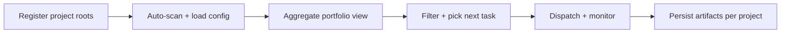

# Multi-project multitasking

## Pain scenario

Most developer tools are optimised for one repository at a time. When you operate across multiple projects, you end up with:

- Parallel “mental tabs” with no single place to see what is active.
- Slow context switches (window juggling, terminal history hunting, re-opening docs).
- Progress that lives in people’s heads rather than as durable artifacts.

## Project Manager solution

Project Manager is built around a workstation model that makes multi-project operations first-class:

- One portfolio dashboard to see cross-project progress.
- Consistent feature folders and artifacts across projects.
- A unified dispatch flow to IDEs and agent runtimes.

## Implementation flow

### Steps

1. Add multiple project roots so the dashboard can treat them as one portfolio.
2. Ensure each project has a consistent `.project-manager/config.json` and feature folder structure.
3. Use the dashboard filters to slice by lifecycle phase, status, or project.
4. Dispatch work and treat the generated artifacts as the durable progress trail.

## Visual aids

### Portfolio dashboard (illustration)

<svg viewBox="0 0 900 420" width="100%" role="img" aria-label="Illustrated portfolio dashboard with multiple projects and a unified filter bar.">
  <rect x="0" y="0" width="900" height="420" rx="14" fill="#0b0f19" />
  <rect x="18" y="18" width="864" height="60" rx="12" fill="#111827" />
  <text x="40" y="52" fill="#e5e7eb" font-size="14" font-family="system-ui, -apple-system, Segoe UI, Roboto">Portfolio</text>
  <rect x="140" y="32" width="220" height="32" rx="10" fill="#0f172a" stroke="#1f2937" />
  <text x="154" y="52" fill="#9ca3af" font-size="12" font-family="system-ui, -apple-system, Segoe UI, Roboto">Search projects / features…</text>
  <rect x="372" y="32" width="132" height="32" rx="10" fill="#0f172a" stroke="#1f2937" />
  <text x="386" y="52" fill="#e5e7eb" font-size="12" font-family="system-ui, -apple-system, Segoe UI, Roboto">Status</text>
  <rect x="514" y="32" width="132" height="32" rx="10" fill="#0f172a" stroke="#1f2937" />
  <text x="528" y="52" fill="#e5e7eb" font-size="12" font-family="system-ui, -apple-system, Segoe UI, Roboto">Phase</text>
  <rect x="656" y="32" width="110" height="32" rx="10" fill="#064e3b" />
  <text x="672" y="52" fill="#d1fae5" font-size="12" font-family="system-ui, -apple-system, Segoe UI, Roboto">Dispatch</text>

  <rect x="18" y="92" width="864" height="310" rx="12" fill="#111827" />
  <rect x="40" y="118" width="820" height="44" rx="10" fill="#0f172a" stroke="#1f2937" />
  <text x="58" y="146" fill="#e5e7eb" font-size="12" font-family="system-ui, -apple-system, Segoe UI, Roboto">Project</text>
  <text x="260" y="146" fill="#e5e7eb" font-size="12" font-family="system-ui, -apple-system, Segoe UI, Roboto">Feature</text>
  <text x="560" y="146" fill="#e5e7eb" font-size="12" font-family="system-ui, -apple-system, Segoe UI, Roboto">Status</text>
  <text x="690" y="146" fill="#e5e7eb" font-size="12" font-family="system-ui, -apple-system, Segoe UI, Roboto">Updated</text>

  <g>
    <rect x="40" y="172" width="820" height="50" rx="10" fill="#0b1220" stroke="#1f2937" />
    <text x="58" y="202" fill="#e5e7eb" font-size="12" font-family="system-ui, -apple-system, Segoe UI, Roboto">Project A</text>
    <text x="260" y="202" fill="#9ca3af" font-size="12" font-family="system-ui, -apple-system, Segoe UI, Roboto">F12 · Import spec drafts</text>
    <rect x="560" y="186" width="92" height="22" rx="11" fill="#0ea5e9" opacity="0.18" />
    <text x="572" y="202" fill="#7dd3fc" font-size="11" font-family="system-ui, -apple-system, Segoe UI, Roboto">In progress</text>
    <text x="690" y="202" fill="#9ca3af" font-size="12" font-family="system-ui, -apple-system, Segoe UI, Roboto">2h ago</text>
  </g>
  <g>
    <rect x="40" y="228" width="820" height="50" rx="10" fill="#0b1220" stroke="#1f2937" />
    <text x="58" y="258" fill="#e5e7eb" font-size="12" font-family="system-ui, -apple-system, Segoe UI, Roboto">Project B</text>
    <text x="260" y="258" fill="#9ca3af" font-size="12" font-family="system-ui, -apple-system, Segoe UI, Roboto">F03 · Fix dispatch regression</text>
    <rect x="560" y="242" width="74" height="22" rx="11" fill="#10b981" opacity="0.18" />
    <text x="572" y="258" fill="#86efac" font-size="11" font-family="system-ui, -apple-system, Segoe UI, Roboto">Done</text>
    <text x="690" y="258" fill="#9ca3af" font-size="12" font-family="system-ui, -apple-system, Segoe UI, Roboto">1d ago</text>
  </g>
  <g>
    <rect x="40" y="284" width="820" height="50" rx="10" fill="#0b1220" stroke="#1f2937" />
    <text x="58" y="314" fill="#e5e7eb" font-size="12" font-family="system-ui, -apple-system, Segoe UI, Roboto">Project C</text>
    <text x="260" y="314" fill="#9ca3af" font-size="12" font-family="system-ui, -apple-system, Segoe UI, Roboto">F07 · Add plugin contract</text>
    <rect x="560" y="298" width="86" height="22" rx="11" fill="#ef4444" opacity="0.18" />
    <text x="572" y="314" fill="#fca5a5" font-size="11" font-family="system-ui, -apple-system, Segoe UI, Roboto">Blocked</text>
    <text x="690" y="314" fill="#9ca3af" font-size="12" font-family="system-ui, -apple-system, Segoe UI, Roboto">3d ago</text>
  </g>
</svg>

## Navigate

- Previous: [Fragmented tools → One control surface](./fragmented-tools)
- Next: [Prompt context automation](./prompt-context-automation)

