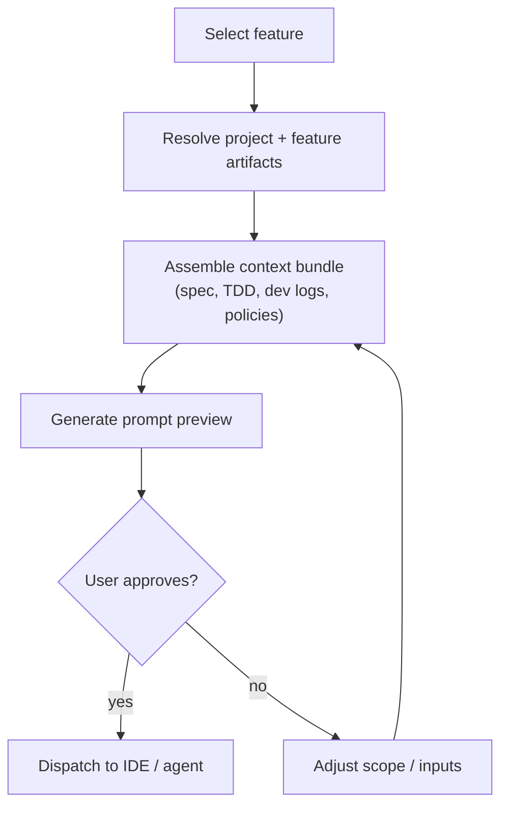

# Prompt context automation

## Pain scenario

AI-assisted execution fails most often before it starts: every dispatch requires a human to gather context and build a prompt.

Typical failure modes:

- Missing spec excerpts or stale links.
- Inconsistent “definitions of done” between runs.
- Repeating the same context packaging work for every task.

## Project Manager solution

Project Manager treats context as a first-class input:

- Auto-assembles relevant files and metadata into a prompt context bundle.
- Supports reusable Coordinator + AI Agent templates so the same patterns repeat reliably.
- Makes prompt preview explicit before execution.

## Implementation flow

### Steps

1. Standardise what “context” means in your team (spec, TDD, relevant code areas, policies, recent logs).
2. Keep context sources in stable locations (feature folder + known document roots).
3. Use prompt preview as the checkpoint: confirm scope, artifacts, and expected output format.
4. Dispatch only after context looks correct; treat the preview as the “contract” for the run.

## Visual aids

### Prompt preview (illustration)

<svg viewBox="0 0 900 380" width="100%" role="img" aria-label="Illustrated prompt preview showing a context bundle and guardrail approval controls.">
  <rect x="0" y="0" width="900" height="380" rx="14" fill="#0b0f19" />
  <rect x="18" y="18" width="864" height="344" rx="12" fill="#111827" />
  <text x="40" y="52" fill="#e5e7eb" font-size="14" font-family="system-ui, -apple-system, Segoe UI, Roboto">Prompt preview</text>
  <text x="40" y="76" fill="#9ca3af" font-size="12" font-family="system-ui, -apple-system, Segoe UI, Roboto">Auto-assembled context bundle</text>

  <rect x="40" y="96" width="520" height="224" rx="12" fill="#0f172a" stroke="#1f2937" />
  <text x="58" y="126" fill="#e5e7eb" font-size="12" font-family="system-ui, -apple-system, Segoe UI, Roboto">Included artifacts</text>
  <rect x="58" y="140" width="484" height="28" rx="8" fill="#111827" stroke="#1f2937" />
  <text x="70" y="158" fill="#e5e7eb" font-size="11" font-family="system-ui, -apple-system, Segoe UI, Roboto">feature-spec.md</text>
  <rect x="58" y="176" width="484" height="28" rx="8" fill="#111827" stroke="#1f2937" />
  <text x="70" y="194" fill="#e5e7eb" font-size="11" font-family="system-ui, -apple-system, Segoe UI, Roboto">tdd-spec.md</text>
  <rect x="58" y="212" width="484" height="28" rx="8" fill="#111827" stroke="#1f2937" />
  <text x="70" y="230" fill="#e5e7eb" font-size="11" font-family="system-ui, -apple-system, Segoe UI, Roboto">dev-log.md</text>
  <rect x="58" y="248" width="484" height="28" rx="8" fill="#111827" stroke="#1f2937" />
  <text x="70" y="266" fill="#e5e7eb" font-size="11" font-family="system-ui, -apple-system, Segoe UI, Roboto">company-standards.md</text>

  <rect x="574" y="96" width="308" height="224" rx="12" fill="#0f172a" stroke="#1f2937" />
  <text x="592" y="126" fill="#e5e7eb" font-size="12" font-family="system-ui, -apple-system, Segoe UI, Roboto">Guardrails</text>
  <text x="592" y="150" fill="#9ca3af" font-size="11" font-family="system-ui, -apple-system, Segoe UI, Roboto">Scope</text>
  <rect x="592" y="158" width="272" height="26" rx="8" fill="#111827" stroke="#1f2937" />
  <text x="604" y="176" fill="#e5e7eb" font-size="11" font-family="system-ui, -apple-system, Segoe UI, Roboto">Only files in selected feature</text>
  <text x="592" y="212" fill="#9ca3af" font-size="11" font-family="system-ui, -apple-system, Segoe UI, Roboto">Output</text>
  <rect x="592" y="220" width="272" height="26" rx="8" fill="#111827" stroke="#1f2937" />
  <text x="604" y="238" fill="#e5e7eb" font-size="11" font-family="system-ui, -apple-system, Segoe UI, Roboto">Artifacts + summary required</text>

  <rect x="574" y="332" width="148" height="28" rx="10" fill="#064e3b" />
  <text x="598" y="351" fill="#d1fae5" font-size="12" font-family="system-ui, -apple-system, Segoe UI, Roboto">Approve</text>
  <rect x="734" y="332" width="148" height="28" rx="10" fill="#1f2937" />
  <text x="760" y="351" fill="#e5e7eb" font-size="12" font-family="system-ui, -apple-system, Segoe UI, Roboto">Edit</text>
</svg>

## Navigate

- Previous: [Multi-project multitasking](./multi-project-multi-task)
- Next: [Live agent observability](./live-agent-observability)

