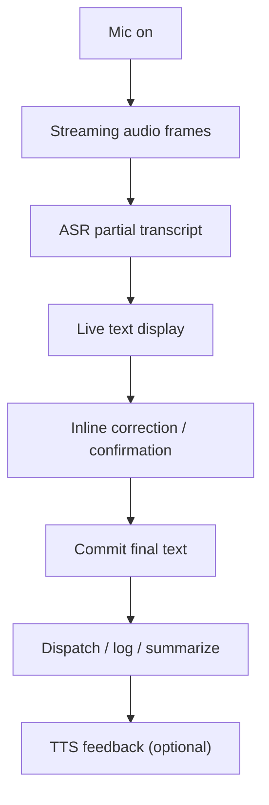

# Real-time voice (ASR + TTS)

## Pain scenario

Many products expose voice as “recording mode”:

1. Start recording
2. Speak
3. Stop recording
4. Wait for transcription

This creates friction and prevents fast correction. If transcription is wrong, the user often must re-record or manually edit a delayed result.

## Project Manager solution

Project Manager uses real-time voice interaction:

- Real-time ASR: spoken content appears as you speak.
- Immediate corrections: typos and recognition errors can be fixed early.
- Optional TTS: the system can read back confirmations, summaries, or next steps.

## Implementation flow

### Steps

1. Present a live transcript surface that updates continuously (partial → final).
2. Provide an inline correction affordance while the user is still speaking.
3. Commit the final transcript as the canonical instruction (stored and auditable).
4. Use TTS for low-friction confirmations and summaries when the user is hands-busy.

## Visual aids

### Live transcript with inline correction (illustration)

<svg viewBox="0 0 900 380" width="100%" role="img" aria-label="Illustrated live transcript view with real-time corrections and an optional read-back toggle.">
  <rect x="0" y="0" width="900" height="380" rx="14" fill="#0b0f19" />
  <rect x="18" y="18" width="864" height="344" rx="12" fill="#111827" />

  <text x="40" y="52" fill="#e5e7eb" font-size="14" font-family="system-ui, -apple-system, Segoe UI, Roboto">Voice</text>
  <text x="40" y="76" fill="#9ca3af" font-size="12" font-family="system-ui, -apple-system, Segoe UI, Roboto">Real-time transcript + correction</text>

  <rect x="40" y="96" width="560" height="220" rx="12" fill="#0f172a" stroke="#1f2937" />
  <text x="60" y="130" fill="#e5e7eb" font-size="12" font-family="ui-monospace, SFMono-Regular, Menlo, Monaco, Consolas">“Update the PRD solution table and add URLs…”</text>
  <rect x="58" y="148" width="520" height="30" rx="10" fill="#111827" stroke="#1f2937" />
  <text x="70" y="169" fill="#e5e7eb" font-size="12" font-family="ui-monospace, SFMono-Regular, Menlo, Monaco, Consolas">…and generate each page for pain points</text>

  <rect x="58" y="196" width="520" height="40" rx="12" fill="#0b1220" stroke="#1f2937" />
  <text x="70" y="221" fill="#e5e7eb" font-size="12" font-family="ui-monospace, SFMono-Regular, Menlo, Monaco, Consolas">“flow char”</text>
  <rect x="180" y="206" width="132" height="22" rx="11" fill="#7c2d12" opacity="0.25" />
  <text x="192" y="222" fill="#fdba74" font-size="11" font-family="system-ui, -apple-system, Segoe UI, Roboto">typo detected</text>
  <rect x="322" y="206" width="158" height="22" rx="11" fill="#064e3b" opacity="0.35" />
  <text x="334" y="222" fill="#a7f3d0" font-size="11" font-family="system-ui, -apple-system, Segoe UI, Roboto">suggest: flowchart</text>

  <rect x="620" y="96" width="242" height="220" rx="12" fill="#0f172a" stroke="#1f2937" />
  <text x="640" y="130" fill="#e5e7eb" font-size="12" font-family="system-ui, -apple-system, Segoe UI, Roboto">Feedback</text>
  <rect x="640" y="146" width="202" height="28" rx="10" fill="#111827" stroke="#1f2937" />
  <text x="652" y="165" fill="#e5e7eb" font-size="11" font-family="system-ui, -apple-system, Segoe UI, Roboto">Read-back (TTS)</text>
  <rect x="640" y="186" width="202" height="76" rx="12" fill="#111827" stroke="#1f2937" />
  <text x="652" y="212" fill="#9ca3af" font-size="11" font-family="system-ui, -apple-system, Segoe UI, Roboto">“OK. I will update the docs</text>
  <text x="652" y="232" fill="#9ca3af" font-size="11" font-family="system-ui, -apple-system, Segoe UI, Roboto">site and link the pages.”</text>

  <rect x="620" y="332" width="116" height="28" rx="10" fill="#064e3b" />
  <text x="646" y="351" fill="#d1fae5" font-size="12" font-family="system-ui, -apple-system, Segoe UI, Roboto">Commit</text>
  <rect x="746" y="332" width="116" height="28" rx="10" fill="#1f2937" />
  <text x="772" y="351" fill="#e5e7eb" font-size="12" font-family="system-ui, -apple-system, Segoe UI, Roboto">Cancel</text>
</svg>

## Navigate

- Previous: [Coordinator + AI Agents framework](./coordinator-agent-framework)
- Next: [Overview](./)

